# WAD - Web Application Document - Módulo 2 - Inteli

**_Os trechos em itálico servem apenas como guia para o preenchimento da seção. Por esse motivo, não devem fazer parte da documentação final_**

## WebCulture Group

#### Ana Beatriz Passos Beggiato
#### André Dleizer Prado
#### Cecília Lima Coelho
#### Laura de Araújo Rodrigues
#### Mariana Namie Guima
#### Marlos do Carmo Guedes
#### Thalyta da Silva Viana


## Sumário

[1. Introdução](#c1)

[2. Visão Geral da Aplicação Web](#c2)

[3. Projeto Técnico da Aplicação Web](#c3)

[4. Desenvolvimento da Aplicação Web](#c4)

[5. Testes da Aplicação Web](#c5)

[6. Conclusões e trabalhos futuros](#c6)

[7. Referências](#c7)

[Anexos](#c8)

<br>


# <a name="c1"></a>1. Introdução

&nbsp;&nbsp;&nbsp;&nbsp;A ZUYD é uma instituição de ensino superior localizada em Maastricht¹, na Europa, especializada em Ciências Aplicadas. Suas aulas são conhecidas por serem altamente interativas e centradas em projetos, ministradas em grupos com até 15 alunos. Essa abordagem pedagógica favorece um desenvolvimento profissional qualificado e criativo, proporcionando espaço para orientação individualizada.³
<br>
&nbsp;&nbsp;&nbsp;&nbsp;No entanto, o parceiro destacou a problemática acerca da comunicação dentro do jogo "Cesim *Game*", sendo que esta comunicação entre os grupos é notavelmente ineficiente, devido à ausência de uma plataforma adequada para essas interações. Além disso, a diversidade cultural dos participantes contribui para a existência de diversos preconceitos, agravando ainda mais o problema.
<br>
&nbsp;&nbsp;&nbsp;&nbsp;Assim, à medida que a tecnologia avança, torna-se necessário promover a integração desses estudantes nos contextos em que estão inseridos. Surge, portanto, a necessidade de elaborar um sistema web que promova a colaboração e a comunicação eficaz entre os participantes do "Cesim *Game*". Este projeto propõe a criação de uma plataforma dedicada à integração dos estudantes envolvidos nessa simulação de negócios, com o propósito de facilitar uma cooperação mais sólida e uma comunicação transparente entre os membros do grupo.
<br>
&nbsp;&nbsp;&nbsp;&nbsp;Além disso, a plataforma oferece espaços onde os usuários podem expressar suas opiniões sobre seus colegas de equipe, bem como visualizar os feedbacks recebidos, contribuindo, assim, para um ambiente de aprendizado colaborativo e construtivo. Este sistema não apenas visa aprimorar a experiência dos estudantes envolvidos, mas também a maximizar os benefícios educacionais proporcionados pelas simulações de negócios, preparando-os para os desafios do mundo empresarial por meio do desenvolvimento de habilidades de trabalho em equipe e comunicação efetiva.

# <a name="c2"></a>2. Visão Geral da Aplicação Web
&nbsp;&nbsp;&nbsp;&nbsp;Nesta seção, voltada para a visão geral da aplicação web em desenvolvimento, serão abordados tópicos importantes para o desenvolvimento do projeto, tais como seu escopo - o qual apresenta uma análise de contexto do parceiro -, as personas ideais para a utilização do site e as user stories criadas em torno do projeto a fim de traçar sua rota de desenvolvimento. Assim, a visão geral da aplicação web traz os tópicos fundamentais para a compreensão do parceiro de projeto, assim como demonstra uma base para traçar o caminho de desenvolvimento da solução proposta.

## 2.1. Escopo do Projeto

&nbsp;&nbsp;&nbsp;&nbsp;No cenário competitivo atual, entender a dinâmica da indústria é crucial para o sucesso empresarial. A análise de mercado não só oferece insights valiosos sobre o ambiente empresarial, mas também ajuda a identificar oportunidades e ameaças. Nesse contexto, várias ferramentas de negócios são exploradas para desenvolver uma análise completa do mercado. Para isso, é essencial compreender o contexto da indústria em que a empresa atua.
<br>
&nbsp;&nbsp;&nbsp;&nbsp;Além disso, são aplicadas ferramentas como as 5 Forças de Porter, amplamente utilizadas para analisar a concorrência no mercado, e a análise SWOT, que contribui para entender as forças, fraquezas, oportunidades e ameaças da empresa. O Canvas de Proposta de Valor também é uma ferramenta importante, pois descreve os atributos da solução oferecida pela empresa. Por último, a Matriz de Riscos é empregada para monitorar os riscos do projeto. Essas ferramentas combinadas oferecem uma visão holística do mercado e da posição da empresa dentro dele, permitindo que os gestores tomem decisões mais informadas e eficazes para o sucesso empresarial.

### 2.1.1. Contexto da indústria

&nbsp;&nbsp;&nbsp;&nbsp;A Universidade Zuyd de Ciências Aplicadas, Europa, destaca-se por sua abordagem ambiciosa e focada na qualidade da educação, pesquisa e programas de formação profissional. Sua escala relativamente pequena permite uma atenção personalizada aos alunos, enquanto suas colaborações intensivas com empresas e instituições promovem a aplicação prática do conhecimento. Com uma população estudantil diversificada, aproximadamente 11% dos 14.600 alunos da Zuyd são internacionais, refletindo o ambiente acolhedor da instituição para estudantes de todo o mundo. Dito isto, de acordo com o site "QS Top Universities", a Zuyd ocupa a posição #141 no ranking de universidades do ocidente da Europa, e, considerando todo o continente a Zuyd ocupa a posição #541-550 no ranking.


### 2.1.2. Modelo de 5 Forças de Porter

&nbsp;&nbsp;&nbsp;&nbsp;Nesta parte do projeto, foi analisado e aplicado o "Modelo de 5 Forças de Porter" para avaliar as dinâmicas competitivas enfrentadas pela Universidade Zuyd no setor de ensino superior. Desenvolvido por Michael E. Porter, este modelo é fundamental para identificar e analisar cinco forças competitivas que definem cada indústria e mercado, influenciando diretamente nossa capacidade de atender os estudantes e gerar valor sustentável.

&nbsp;&nbsp;&nbsp;&nbsp;A seguir, detalhamos cada uma dessas forças no contexto universitário, oferecendo insights sobre a rivalidade entre concorrentes, a ameaça de novos entrantes, o poder de barganha de fornecedores e clientes, e a ameaça de produtos ou serviços substitutos. Esta análise nos permite não apenas entender o ambiente competitivo em que operamos, mas também identificar áreas estratégicas essenciais para reforçar a posição no mercado educacional.

<div align="center">
  <sub>Figura 01 - 5 Forças de Porter </sub>
  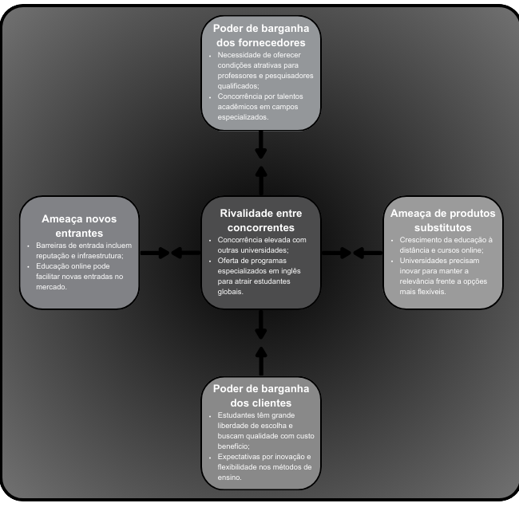
  <sup>Fonte: Elaborado pelos autores (2024)</sup>
</div>

&nbsp;&nbsp;&nbsp;&nbsp;1. Rivalidade entre Concorrentes: Esta força destaca a competição entre a Zuyd University e outras instituições de ensino superior. A universidade enfrenta concorrentes tanto holandeses quanto internacionais, o que a obriga a manter a excelência e a inovação nos programas oferecidos, especialmente aqueles em inglês, que atraem estudantes globais. A rivalidade impulsiona a universidade a diferenciar-se por meio de uma oferta educacional de qualidade, visando destacar-se no mercado.
<br>
&nbsp;&nbsp;&nbsp;&nbsp;2. Ameaça de Novos Entrantes: As barreiras de entrada incluem a reputação institucional e a infraestrutura necessária para o funcionamento de uma universidade. Embora essas barreiras possam ser significativas, a crescente popularidade da educação online tem o potencial de diminuir tais obstáculos, tornando mais fácil a entrada de novos players no mercado e ameaçando a posição de instituições estabelecidas como a Zuyd.
<br>
&nbsp;&nbsp;&nbsp;&nbsp;3. Poder de Barganha dos Fornecedores: Os fornecedores no contexto universitário são principalmente os acadêmicos e pesquisadores. Para a Zuyd, é crucial oferecer condições atrativas para garantir a contratação e a retenção de professores e pesquisadores de alto calibre, contribuindo assim para a qualidade do ensino e da pesquisa. A competição por talentos em campos especializados aumenta o poder de barganha desses fornecedores.
<br>
&nbsp;&nbsp;&nbsp;&nbsp;4. Poder de Barganha dos Clientes (Estudantes): Os estudantes, enquanto clientes, possuem um alto poder de barganha. Eles têm a liberdade de escolher entre várias instituições, buscando um equilíbrio entre a qualidade de ensino e o custo da educação. As expectativas dos estudantes por inovação e flexibilidade nos métodos de ensino incentivam as universidades a se adaptarem continuamente às suas necessidades e preferências.
<br>
&nbsp;&nbsp;&nbsp;&nbsp;5. Ameaça de Produtos ou Serviços Substitutos: O crescimento da educação à distância e dos cursos online representa uma ameaça significativa aos modelos educacionais tradicionais. A Zuyd *University* pode ter que inovar e se adaptar para manter sua relevância diante dessas opções de ensino mais flexíveis e, muitas vezes, mais acessíveis, as quais atendem a um público mais amplo e diversificado.
<br>

### 2.1.3. Análise SWOT

&nbsp;&nbsp;&nbsp;&nbsp;A análise SWOT, é uma ferramenta utilizada no planejamento empresarial, com a finalidade de avaliar os fatores que impactam a empresa. Esta análise inclui causas externas e internas, sendo que as forças e fraquezas estão relacionadas ao ambiente interno, enquanto as oportunidades e ameaças dizem respeito ao ambiente externo.
<br>

<div align="center">
  <sub>Figura 02 - Análise SWOT</sub>
  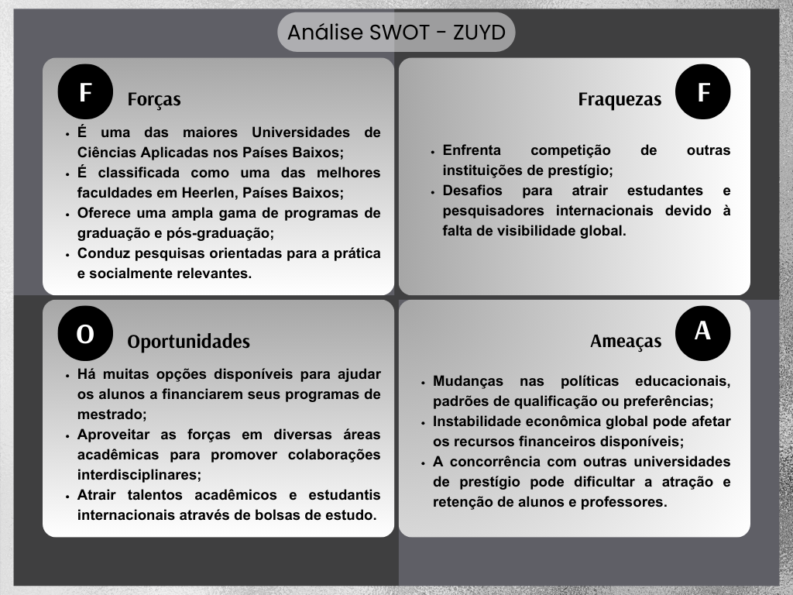
  <sup>Fonte: Elaborado pelos autores (2024)</sup>
</div>

<br>
&nbsp;&nbsp;&nbsp;&nbsp;Em paralelo a essa análise, a Universidade ZUYD, em Heerlen, é uma das maiores nos Países Baixos, com uma vasta oferta de graduações e pós.¹ Reconhecida por sua excelência e pesquisa relevante, enfrenta desafios como a competição e a visibilidade internacional limitada. Apesar disso, vê oportunidades em financiamento e colaborações interdisciplinares.²
<br>
&nbsp;&nbsp;&nbsp;&nbsp;No entanto, ameaças como mudanças políticas e instabilidade econômica representam riscos para seu crescimento e desenvolvimento futuro. Sua reputação como uma das melhores faculdades em Heerlen solidifica sua posição como um centro de excelência educacional¹, mas atrair estudantes e pesquisadores internacionais ainda é um desafio.

### 2.1.4. Solução: 

&nbsp;&nbsp;&nbsp;&nbsp;A ZUYD *University of Applied Sciences* realiza um jogo de negócios em equipe denominado “Cesim Game”, no qual alunos de diferentes culturas precisam interagir a fim de solucionar os casos apresentados no jogo. Entretanto, nessas interações, as diferenças interculturais costumam dificultar a comunicação entre os participantes, fato esse que pode levar a equipe a uma convivência desarmônica, prejudicando seu desempenho.
<br>
&nbsp;&nbsp;&nbsp;&nbsp;Visando a solução de tal problema, a *WebCulture Group* propõe uma aplicação web na qual os membros de cada grupo possam acessar o feedback dado por seus colegas, tendo acesso a informações importantes como uma comparação entre sua autoavaliação e sua avaliação de pares, assim como particularidades pessoais ou culturais que possam impactar direta ou indiretamente seu trabalho no grupo. 
<br>
&nbsp;&nbsp;&nbsp;&nbsp;Para que essa aplicação possa ser utilizada, o competidor precisará fazer seu login no site, tendo então acesso a uma homepage na qual serão disponibilizados acessos a páginas como “perfil”, “grupo”, “uploads” e “formulários”, as quais serão responsáveis por garantir a cada participante uma visão geral de si e de seus colegas, proporcionando assim uma convivência mais harmônica no grupo.
<br>
&nbsp;&nbsp;&nbsp;&nbsp;A solução proposta proporciona aos participantes uma melhor visão sobre o seu desempenho no grupo do ponto de vista dos seus colegas, permitindo assim melhorias pessoais e entendimento de seus perfis de atuação dentro do grupo. Com isso, são geradas motivações para comunicações mais diretas voltadas para a resolução dos conflitos dentro do time, permitindo, assim, uma convivência mais harmônica.
<br>
&nbsp;&nbsp;&nbsp;&nbsp;A fim de medir o sucesso da solução, serão avaliados os desempenhos comportamentais e comunicativos de cada grupo, ou seja, se a solução for efetiva, cada grupo terá uma comunicação mais efetiva em momentos de conflito, assim como os membros terão mais abertura para fornecer feedbacks aos colegas, evitando, com isso, ruídos de comunicação que prejudiquem a harmonia do grupo.


### 2.1.5. Proposta de Valor

&nbsp;&nbsp;&nbsp;&nbsp;O Canvas de Proposta de Valor é definido para visualizar, projetar e testar a criação de valor da empresa para o cliente. Para isso, o Canvas aborda não só as dores e ganhos de valor por parte do cliente, mas também os analgésicos e criadores de valor por parte da solução que está sendo desenvolvida. Assim, para a aplicação em questão, foi desenvolvido o seguinte Canvas de Proposta de Valor:

<div align="center">
<sub>Figura 03 - Value Proposition Canvas</sub>
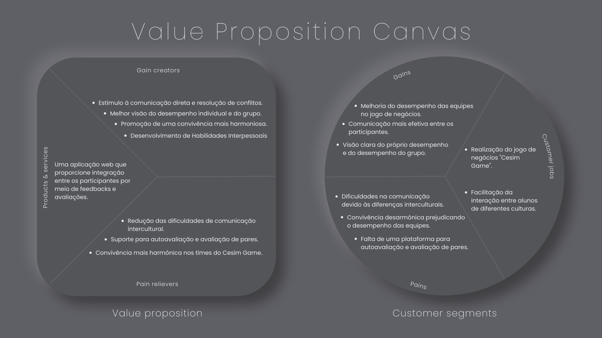
<sup>Fonte: Material produzido pelos autores (2024)</sup>
</div>

Proposta de Valor:
- Produtos/Serviços:
  - Uma aplicação web que proporcione integração entre os participantes por meio de feedbacks e avaliações.
- Analgésicos (Alívio de Dores):
  - Redução das dificuldades de comunicação intercultural.
  - Melhoria do desempenho das equipes no jogo de negócios.
  - Diminuição da convivência desarmônica.
- Criadores de Ganhos:
  - Melhor visão do desempenho individual e do grupo.
  - Estímulo à comunicação direta e resolução de conflitos.
  - Promoção de uma convivência mais harmoniosa.
  - Desenvolvimento de atividades interpessoais.

Cliente:
- Trabalhos:
  - Realização do jogo de negócios "Cesim Game".
  - Facilitação da interação entre alunos de diferentes culturas.
- Dores:
  - Dificuldades na comunicação devido às diferenças interculturais.
  - Convivência desarmônica prejudicando o desempenho das equipes.
  -  de uma plataforma para autoavaliação e avaliação de pares.
- Ganhos:
  - Melhoria do desempenho das equipes no jogo de negócios.
  - Comunicação mais efetiva entre os participantes.
  - Visão clara do próprio desempenho e do desempenho do grupo.

&nbsp;&nbsp;&nbsp;&nbsp;Em suma, o Canvas de Proposta de Valor oferece uma visão abrangente dos elementos necessários para a criação de valor da solução proposta, considerando as necessidades e expectativas do cliente. Ao abordar tanto as dores enfrentadas quanto os ganhos esperados, bem como os analgésicos e criadores de valor proporcionados pela solução, o Canvas se torna uma ferramenta importante para orientar o desenvolvimento de produtos e serviços centrados no cliente.


### 2.1.6. Matriz de Riscos 

&nbsp;&nbsp;&nbsp;&nbsp;A matriz de riscos é uma ferramenta estratégica indispensável, mapeando a probabilidade e o impacto de potenciais problemas, desde comunicações falhas até situações improváveis. Ela é crucial para priorizar os esforços devidos, ajustando-se continuamente às mudanças do cenário do projeto, e assegura que estejamos preparados para enfrentar e gerenciar desafios de forma eficaz, mantendo o projeto alinhado com os objetivos estipulados.

<div align="center">
<sub>Figura 04 - Matriz de Riscos</sub>
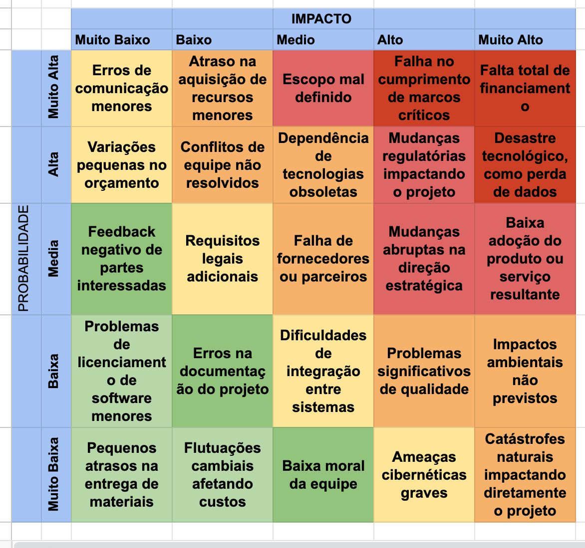
<sup>Fonte: Material produzido pelos autores (2024)</sup>
</div>

&nbsp;&nbsp;&nbsp;&nbsp;A análise da matriz de riscos sublinha a necessidade de uma gestão de riscos ágil e informada, essencial para o desenvolvimento da nossa plataforma. Ela orienta a implementação de protocolos de amenização e recuperação, destacando a importância de planos de contingência que abordam tanto inconvenientes menores quanto eventos de alto impacto, assegurando a continuidade do projeto e a confiança dos stakeholders na gestão eficiente das incertezas quanto ao nosso trabalho.

## 2.2. Personas

&nbsp;&nbsp;&nbsp;&nbsp;As personas são representações fictícias de possíveis usuários de um produto ou serviço, as quais são baseadas em dados demográficos a fim de tornar seu perfil mais verídico. Elas demonstram os objetivos, necessidades e frustações do cliente para que o produto seja desenvolvido focado nas dores e metas do usuário, tornando-o mais conveniente e competitivo no mercado <sup>5</sup>. Enquanto isso, os mapas de empatia analisam e detalham mais profundamente os sentimentos, pensamentos, falas e ações do cliente, sendo útil para complementar as personas <sup>6</sup>.

&nbsp;&nbsp;&nbsp;&nbsp;No projeto com a Zuyd, um site será criado para a avaliação entre os alunos do jogo Cesim Global Challenge e para o monitoramento desse grupo pelo tutor. Dessa forma, foram mapeadas duas personas: uma para o aluno e outra para o tutor. Abaixo, seguem as personas com seus respectivos mapas de empatia.

<div align="center">
<sub>Figura 05 - Persona do aluno 1</sub>
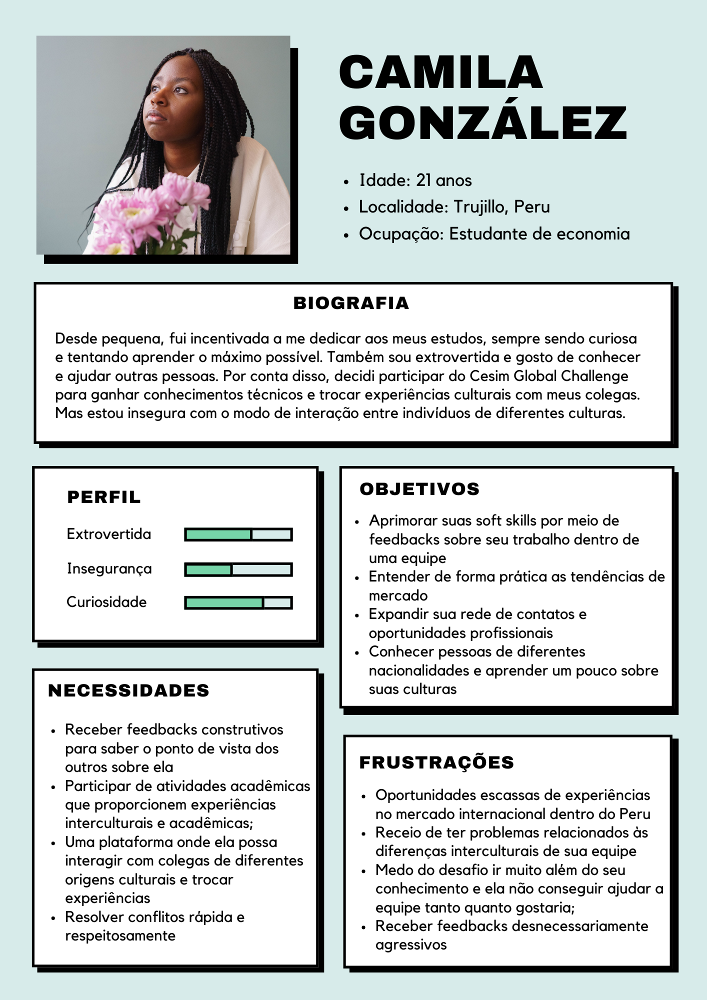
<sup>Fonte: Material produzido pelos autores (2024)</sup>
</div>

<div align="center">
<sub>Figura 06 - Mapa de empatia do aluno 1</sub>

<sup>Fonte: Material produzido pelos autores (2024)</sup>
</div>

&nbsp;&nbsp;&nbsp;&nbsp;A partir dessa persona, pode-se mapear a preocupação com a tolerância e o preconceito cultural, a importância do respeito e a necessidade de feedbacks sobre o seu desempenho. Dessa forma, deve-se desenvolver um website que permita trocas culturais e disponibilize feedbacks somente com alternativas, para evitar que grosserias sejam escritas.


<div align="center">
<sub>Figura 07 - Persona do aluno 2</sub>
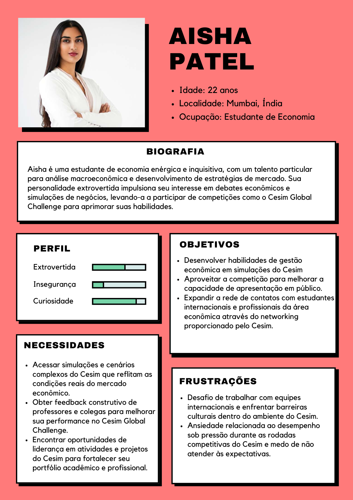
<sup>Fonte: Material produzido pelos autores (2024)</sup>
</div>

<div align="center">
<sub>Figura 08 - Mapa de empatia do aluno 2</sub>
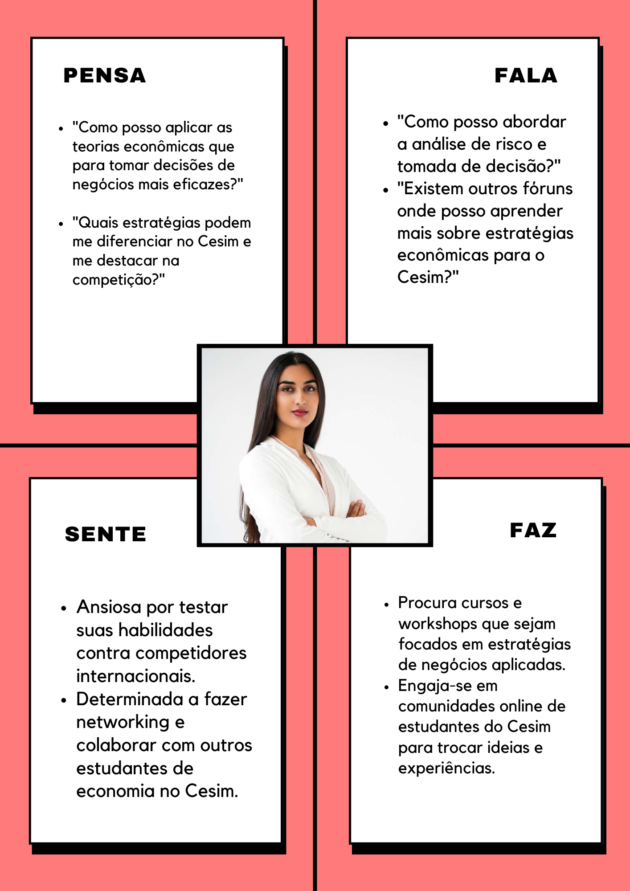
<sup>Fonte: Material produzido pelos autores (2024)</sup>
</div>

&nbsp;&nbsp;&nbsp;&nbsp; Percebe-se a preocupação dessa persona de se destacar por excelência acadêmica e fazer networking. Assim, para indivíduos com esse perfil, seria conveniente que nosso site tivesse uma área para postar conteúdos acadêmicos, uma vez que isso propiciaria a troca de conhecimentos entre os membros do grupo.

<div align="center">
<sub>Figura 09 - Persona do tutor</sub>
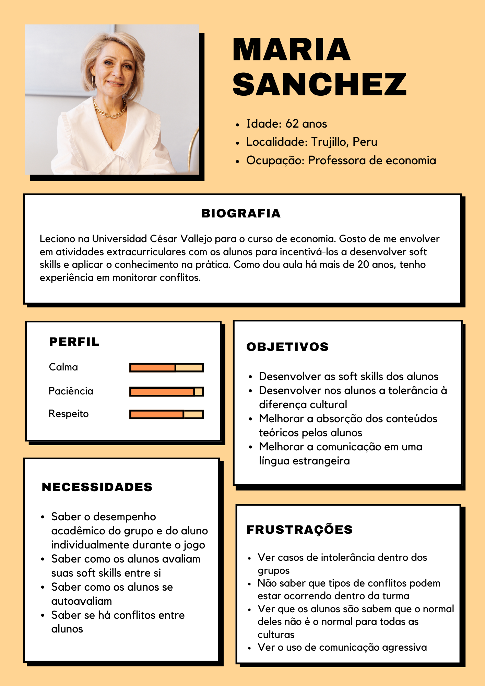
<sup>Fonte: Material produzido pelos autores (2024)</sup>
</div>

<div align="center">
<sub>Figura 10 - Mapa de empatia do tutor</sub>
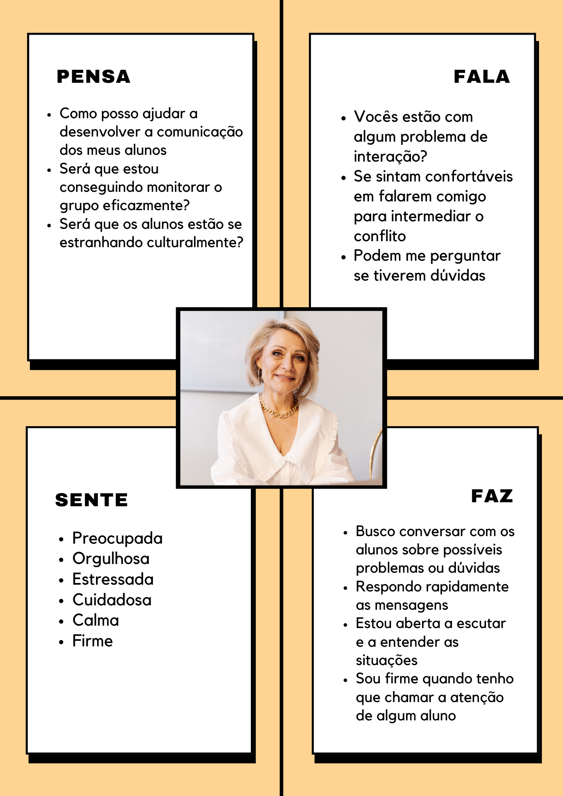
<sup>Fonte: Material produzido pelos autores (2024)</sup>
</div>

&nbsp;&nbsp;&nbsp;&nbsp;Essa persona mostra um possível perfil de tutor, a qual se demonstra proativa e preocupada com as interações entre os alunos e com a resolução de conflitos. Por conta disso, recomenda-se criar um perfil para os tutores que os permitam ver as avaliações e os feedbacks dos alunos, assim como os tickets abertos pelos estudantes para solucionar conflitos.

&nbsp;&nbsp;&nbsp;&nbsp; Dessa maneira, observa-se a importância das personas para mapear as necessidades e as dores dos usuários que podem ser solucionadas ou amenizadas pela nossa aplicação web. Por fim, elas também auxiliarão na elaboração das user stories, as quais serão apresentadas e explicadas no tópico 2.3.

## 2.3. User Stories 

&nbsp;&nbsp;&nbsp;&nbsp;User stories são frases que simulam a perspectiva do cliente, destacando quem ele é, as suas necessidades e os benefícios da realização das suas necessidades. Tal ferramenta é importante para mapear os requesitos dos usuário e desenvolver produtos ou serviçoes com design centrado no usuário <sup>7</sup>. Assim, para planejar as bases do nosso projeto, foram criadas 15 user stories a fim de visualizar os interesses dos alunos que estão participando do jogo e dos tutores.

<div align="center">
<sub>Tabela 01 - User story 01</sub>
 
Identificação | US01
--- | ---
Persona | Camila González
User Story | Como um estudante, eu quero fazer meu cadastro para conseguir logar na plataforma
Critério de aceite 1 | CR1: Na tela de login deve haver um botão "Cadastre-se", que deve ser clicado e redirecionar para a tela de cadastro
Critério de aceite 2 | CR2: Deve haver um formulário que será preenchido com as informações: nome, sobrenome, idade, nacionalidade, gênero, data de nascimento, email e tipo de conta (estudante ou tutor)
Critério de aceite 3 | CR3: Deve haver um botão no final, que ao ser clicado redireciona o usuário para a tela de login

<sup>Fonte: Material produzido pelos autores (2024)</sup>
</div>


<div align="center">
<sub>Tabela 02 - User story 02</sub>
 
Identificação | US02
--- | ---
Persona | Camila González
User Story | Como um estudante, eu quero logar no site para acessá-lo
Critério de aceite 1 | CR1: Existência de caixa de texto que permita escrever meu login
Critério de aceite 2 | CR2: Existência de caixa de texto que permita escrever minha senha
Critério de aceite 3 | CR3: Existência de um botão que permita logar

<sup>Fonte: Material produzido pelos autores (2024)</sup>
</div>


<div align="center">
<sub>Tabela 03 - User story 03</sub>
 
Identificação | US03
--- | ---
Persona | Camila González
User Story | Como um estudante, eu quero preencher a autoavaliação para melhorar meu autoconhecimento
Critério de aceite 1 | CR1: Na barra de menu deve haver um botão "Avaliação" que redireciona para a tela de avaliações
Critério de aceite 2 | CR2: Botão para iniciar a autoavaliação deve ser clicado e direcionará até o teste
Critério de aceite 3 | CR2: Alternativas devem ser clicadas para serem escolhidas
Critério de aceite 4 | CR3: Deve haver um botão de finalização de teste, o qual redirecionará para o menu principal

<sup>Fonte: Material produzido pelos autores (2024)</sup>
</div>


<div align="center">
<sub>Tabela 04 - User story 04</sub>
 
Identificação | US04
--- | ---
Persona | Camila González
User Story | Como um estudante, eu quero preencher a avaliação de pares para que meus colegas saibam como está o desempenho deles
Critério de aceite 1 | CR1: Na barra de menu deve haver um botão "Avaliação" que redireciona para a tela de avaliações
Critério de aceite 2 | CR2: Botão para iniciar a avaliação de pares deve ser clicado e direcionará até o teste
Critério de aceite 3 | CR3: Lista com os colegas do grupo irá aparecer e o usuário deve clicar em uma das opções
Critério de aceite 4 | CR4: Alternativas devem ser clicadas para serem escolhidas
Critério de aceite 5 | CR5: Deve haver um botão de finalização de teste, o qual redirecionará para a lista de colegas
Critério de aceite 6 | CR6: Na tela da lista de colegas haverá um botão de finalização, o qual redirecionará para o menu principal

<sup>Fonte: Material produzido pelos autores (2024)</sup>
</div>


<div align="center">
<sub>Tabela 05 - User story 05</sub>
 
Identificação | US05
--- | ---
Persona | Camila González
User Story | Como um estudante, eu quero receber/ visualizar os feedbacks para saber o que posso melhorar
Critério de aceite 1 | CR1: Na barra de menu, o botão da tela de feedback deve ser clicado para direcionar a essa tela
Critério de aceite 2 | CR2: Haverá um "dropdown" que pode selecionar qual versão dos feedbacks das rodadas do jogo você quer ver
Critério de aceite 3 | CR3: Haverá uma área para escrever feedbacks para seus colegas
Critério de aceite 4 | CR4: Haverá uma área para ler os feedbacks que seus colegas te deram
Critério de aceite 5 | CR5: Haverá uma área de comparação entre as notas da autoavaliação e as notas que seus colegas deram

<sup>Fonte: Material produzido pelos autores (2024)</sup>
</div>


<div align="center">
<sub>Tabela 06 - User story 06</sub>
 
Identificação | US06
--- | ---
Persona | Camila González
User Story | Como um estudante, eu quero fazer postagens para resolver conflitos específicos com algum colega, dar avisos ou fazer perguntas para o grupo.
Critério de aceite 1 | CR1: Na barra de menu, o botão de "Postagens" deve ser clicado para direcionar a essa tela
Critério de aceite 2 | CR2: Haverá caixas de texto "Assunto" e "Descrição" para que o usuário escreva sobre o post.
Critério de aceite 3 | CR3: Haverá a opção de mencionar colegas por meio de um botão
Critério de aceite 4 | CR4: Haverá um botão "Terminar" para finalizar o post.

<sup>Fonte: Material produzido pelos autores (2024)</sup>
</div>


<div align="center">
<sub>Tabela 07 - User story 07</sub>
 
Identificação | US07
--- | ---
Persona | Camila González
User Story | Como um estudante, eu quero ter acesso a uma tela de perfil que mostre minhas informaçoes básicas para que eu consiga editá-las.
Critério de aceite 1 | CR1: Na barra de menu, o botão de "Profile" deve ser clicado para direcionar a essa tela
Critério de aceite 2 | CR2: Haverá no topo as informações dadas durante o cadastro e uma foto de perfil.
Critério de aceite 3 | CR3: Haverá uma área para o usuário adicionar suas particularidades e qualidades.

<sup>Fonte: Material produzido pelos autores (2024)</sup>
</div>


<div align="center">
<sub>Tabela 08 - User story 08</sub>
 
Identificação | US08
--- | ---
Persona | Camila González
User Story | Como estudante, eu quero ter acesso à home page, onde eu possa ver as tarefas que preciso realizar, as reuniões agendadas e as informações básicas do meu grupo
Critério de aceite 1 | CR1: A side bar deve ter um ícone "Homepage" para que o usuário seja direcionado para ela.
Critério de aceite 2 | CR2: Haverá um happiness meter que mostra a média da satisfação do grupo.
Critério de aceite 3 | CR3: Haverá uma área que mostra a foto de perfil de cada um dos membros do time.
Critério de aceite 4 | CR4: Haverá uma área de "Taks", onde o usuário poderá dividir as tarefas entre "urgente" e "adiável".
Critério de aceite 5 | CR5: Haverá um local em que o usuário poderá ver quais reuniões ele tem e em qual horário.

<sup>Fonte: Material produzido pelos autores (2024)</sup>
</div>


<div align="center">
<sub>Tabela 09 - User story 09</sub>
 
Identificação | US9
--- | ---
Persona | Camila González
User Story | Como estudante, eu quero escolher ver quem é do meu grupo e saber algumas informações sobre eles.
Critério de aceite 1 | CR1: A side bar deve ter um ícone "Time" para que o usuário seja direcionado para ela.
Critério de aceite 2 | CR2: Nessa tela deve ter as fotos dos membros com uma breve descrição das suas informações dadas durante o cadastro e seu happiness meter

<sup>Fonte: Material produzido pelos autores (2024)</sup>
</div>


&nbsp;&nbsp;&nbsp;&nbsp;Dessa forma, as user stories são necessárias para a criação de um site que satisfaça as necessidades e objetivos dos alunos participantes do jogo "Cesim Game" e dos tutores. Para que o projeto seja focado no usuário, as user tasks foram utilizadas para definir as tasks para o desenvolvimento do website no projects do Github. Por fim, tal ferramenta será útil para elaborar o wireframe da apliação  web, o qual será explicado e visualizado posteriormente no tópico 3.2.

# <a name="c3"></a>3. Projeto da Aplicação Web 

&nbsp;&nbsp;&nbsp;&nbsp;O desenvolvimento de uma aplicação web bem-sucedida requer muito planejamento para a implementação de um design bom e responsivo. Nesta seção, abordaremos o processo de criação da nossa aplicação web. Ao longo das sprints 1 a 4, foram dedicados esforços inimagináveis para definir, após muitas tentativas, como nosso website ficará no final.
  
&nbsp;&nbsp;&nbsp;&nbsp;Dentro deste tópico, exploraremos a arquitetura escolhida para a nossa aplicação, os wireframes que serviram como base para o design inicial, o guia de estilos que define a identidade visual, o protótipo de alta fidelidade que representa a interface final e a modelagem do banco de dados que suporta a lógica e o armazenamento de dados da aplicação.

### 3.1. Arquitetura 

&nbsp;&nbsp;&nbsp;&nbsp;Arquitetura de software é o projeto de um sistema de software, que define normas, técnicas e o modo de interação entre os componentes do software. Ela estabelece a base para o desenvolvimento, a evolução e a manutenção do software. As arquiteturas possuem diversos padrões, que devem ser escolhidos de acordo com o modelo de negócio e os requisitos <sup>8</sup>.

&nbsp;&nbsp;&nbsp;&nbsp;No nosso caso, optamos pelo padrão MVC (Model-View-Controller) devido à sua flexibilidade, escalabilidade e reusabilidade. A arquitetura MVC é composta pelo "Model", que estabelece a regra de negócio e as interações com os dados, o "View", que define a apresentação da interface e dos dados para o usuário, e o "Controller", responsável por conectar o "View" ao "Model". Abaixo, segue o design da arquitetura do nosso projeto:

<div align="center">
  <sub>Figura 11 - Diagrama de Arquitetura</sub>
  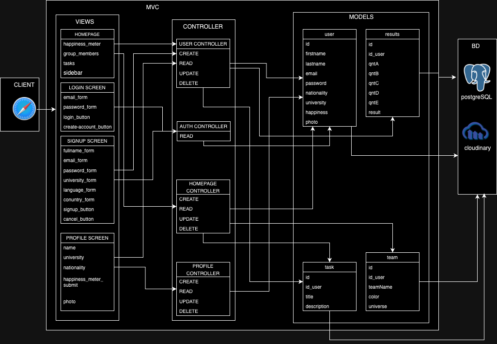
  <br>
  <br>
  <sup>Fonte: Material produzido pelos autores (2024)</sup>
</div>

### Arquitetura MVC com Banco de Dados PostgreSQL

&nbsp;&nbsp;&nbsp;&nbsp;Arquitetura de software é o projeto de um sistema de software, que define normas, técnicas e o modo de interação entre os componentes do software. Ela estabelece a base para o desenvolvimento, a evolução e a manutenção do software. As arquiteturas possuem diversos padrões, que devem ser escolhidos de acordo com o modelo de negócio e os requisitos <sup>8</sup>.
<br>
&nbsp;&nbsp;&nbsp;&nbsp;No nosso caso, optamos pelo padrão MVC (Model-View-Controller) devido à sua flexibilidade, escalabilidade e reusabilidade. A arquitetura MVC é composta pelo "Model", que estabelece a regra de negócio e as interações com os dados, o "View", que define a apresentação da interface e dos dados para o usuário, e o "Controller", responsável por conectar o "View" ao "Model". Abaixo, segue o design da arquitetura do nosso projeto:
<br>

  - **Usuário**: O usuário interage com a aplicação através do cliente.
  - **Cliente**: É a interface pela qual o usuário interage com a aplicação.

### Modelos (Models)

Os Models são responsáveis por representar a estrutura dos dados e interagir diretamente com o banco de dados.

- **user**: 
  - **Atributos**: id, firstname, lastname, email, password, nationality, university, happiness, photo
  - **Associações**: Um usuário pode ter muitas respostas (results) e tarefas (tasks), e pode estar associado a um time (team).

- **results**: 
  - **Atributos**: id, id_user, qntA, qntB, qntC, qntD, qntE, result
  - **Associações**: Referencia um usuário através de id_user.

- **task**: 
  - **Atributos**: id, id_user, title, description
  - **Associações**: Referencia um usuário através de id_user.

- **team**: 
  - **Atributos**: id, id_user, teamName, color, universe
  - **Associações**: Referencia um usuário através de id_user.

### Visões (Views)

As Views são responsáveis por renderizar a interface do usuário e exibir os dados processados pelo Controller. Elas incluem diferentes telas e componentes da interface.

- **Homepage**
  - **happiness_meter**: Componente que exibe um medidor de felicidade.
  - **group_members**: Componente que lista os membros do grupo.
  - **tasks**: Componente que exibe uma lista de tarefas atribuídas ao usuário ou ao grupo.
  - **sidebar**: Componente de navegação que permite ao usuário acessar diferentes partes da aplicação.

- **Login Screen**
  - **email_form**: Campo de entrada para o endereço de e-mail do usuário.
  - **password_form**: Campo de entrada para a senha do usuário.
  - **login_button**: Botão para enviar as credenciais de login.
  - **create-account_button**: Botão que redireciona o usuário para a tela de criação de conta.

- **Signup Screen**
  - **fullname_form**: Campo de entrada para o nome completo do usuário.
  - **email_form**: Campo de entrada para o endereço de e-mail do usuário.
  - **password_form**: Campo de entrada para a senha do usuário.
  - **university_form**: Campo de entrada para o nome da universidade do usuário.
  - **language_form**: Campo de entrada para o idioma preferido do usuário.
  - **country_form**: Campo de entrada para o país do usuário.
  - **signup_button**: Botão para enviar os dados de cadastro.
  - **cancel_button**: Botão para cancelar o processo de cadastro.

- **Profile Screen**
  - **name**: Campo que exibe o nome do usuário.
  - **university**: Campo que exibe a universidade do usuário.
  - **nationality**: Campo que exibe a nacionalidade do usuário.
  - **happiness_meter**: Campo que exibe e permite ajustar o nível de felicidade do usuário.
  - **submit**: Botão para enviar os dados ajustados.
  - **photo**: Campo que exibe a foto do usuário.

- **Evaluation Screen**
  - **form**: Formulário para os usuários responderem às perguntas de avaliação.
  - **submit**: Botão para enviar o formulário de avaliação.

- **Result Screens**
  - **evaluation**: Exibe o resultado da avaliação do usuário com base em suas respostas.
  - **director**: Exibe os detalhes do estilo de colaboração "director".
  - **analyst**: Exibe os detalhes do estilo de colaboração "analyst".
  - **conformist**: Exibe os detalhes do estilo de colaboração "conformist".
  - **harmonizer**: Exibe os detalhes do estilo de colaboração "harmonizer".
  - **initiator**: Exibe os detalhes do estilo de colaboração "initiator".

### Controladores (Controllers)

&nbsp;&nbsp;&nbsp;&nbsp;Os Controllers são responsáveis por receber as requisições do usuário, processar a lógica de negócio e interagir com os Models para obter ou manipular dados. Eles então retornam a resposta apropriada para as Views.

- **User Controller**:
  - **showUserForm**: Renderiza o formulário de inscrição sem layout.
  - **create**: Cria um novo usuário no banco de dados após hashing da senha e formatação dos dados. Define o ID do usuário na sessão e redireciona para a página de login.
  - **upload**: Faz upload da foto do perfil do usuário autenticado e atualiza a URL da foto no banco de dados.

- **Auth Controller**:
  - **login**: Autentica o usuário comparando a senha fornecida com a armazenada no banco de dados usando bcrypt. Se as credenciais estiverem corretas, define o ID do usuário na sessão e redireciona para a página inicial.

- **Homepage Controller**:
  - **overview**: Lê as informações do usuário autenticado e seu nível médio de felicidade da equipe. Renderiza a página inicial com os dados do usuário e a média de felicidade do grupo.
  - **createTask**: Cria uma nova tarefa.
  - **fetchTasks**: Busca todas as tarefas.
  - **deleteTask**: Exclui uma tarefa existente.
  - **updateTask**: Atualiza uma tarefa existente.

- **Profile Controller**:
  - **showProfile**: Exibe o perfil do usuário autenticado. Verifica se o usuário está autenticado e, em caso afirmativo, busca as informações do perfil no banco de dados e as exibe na página de perfil.
  - **updateHappiness**: Atualiza o nível de felicidade do usuário autenticado no banco de dados. Calcula e atualiza a média de felicidade do grupo ao qual o usuário pertence.

- **Colab Controller**:
  - **answer**: Recebe e processa as respostas do formulário de colaboração. Cria um novo registro no banco de dados e redireciona o usuário para a página de resultado correspondente.

&nbsp;&nbsp;&nbsp;&nbsp;Esses Controllers organizam a lógica de negócio em funções especializadas, facilitando a manutenção e a escalabilidade do sistema. Cada Controller é responsável por um conjunto específico de operações, garantindo que a lógica de negócio seja tratada de forma eficiente e organizada.

### Banco de Dados (BD)

- **PostgreSQL**: Sistema de gerenciamento de banco de dados onde as informações dos modelos são armazenadas e gerenciadas. O uso do PostgreSQL como sistema de gerenciamento de banco de dados confere robustez e confiabilidade ao armazenamento e recuperação de dados do sistema.
- **Cloudinary**: Serviço utilizado para armazenar e gerenciar fotos de perfil dos usuários.

&nbsp;&nbsp;&nbsp;&nbsp;Essa arquitetura facilita a manutenção e a escalabilidade do sistema, além de permitir uma clara separação de responsabilidades entre os componentes da aplicação.
&nbsp;&nbsp;&nbsp;&nbsp;Logo, ao manter a separação clara entre Views, Models e Controllers, a aplicação pode ser facilmente mantida e escalada, com cada componente focando em suas responsabilidades específicas. Além disso, arquitetura proposta fornece uma base sólida para o desenvolvimento, evolução e manutenção de um sistema de software, promovendo a modularidade, a extensibilidade e a manutenibilidade do código.


## 3.2. Wireframes 

&nbsp;&nbsp;&nbsp;&nbsp;&nbsp;&nbsp;&nbsp;&nbsp;A criação de wireframes é uma das etapas fundamentais para o desenvolvimento de qualquer aplicação web, servindo como a "blueprint" do design e da usabilidade do site. Neste tópico, serão expostas as interfaces iniciais da nossa aplicação.

<div align="center">
<sub>Figura 12 - LOGIN </sub>
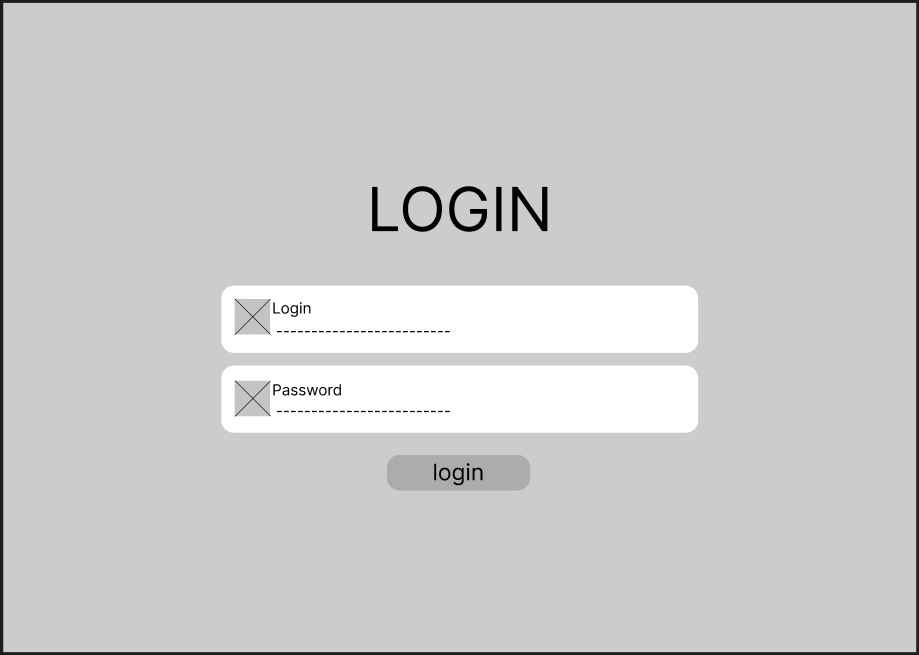
<sup>Fonte: Material produzido pelos autores (2024)</sup>
</div>

<div align="center">
<sub>Figura 13 - CADASTRO </sub>
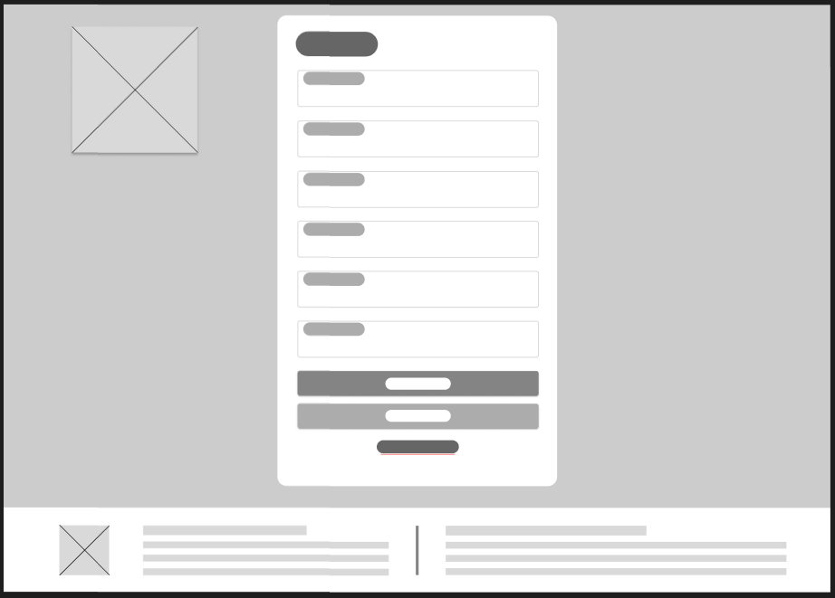
<sup>Fonte: Material produzido pelos autores (2024)</sup>
</div>

<div align="center">
<sub>Figura 14 - INICIAL </sub>
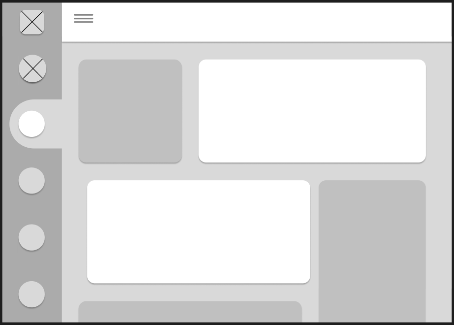
<sup>Fonte: Material produzido pelos autores (2024)</sup>
</div>

<div align="center">
<sub>Figura 15 - PERFIL </sub>
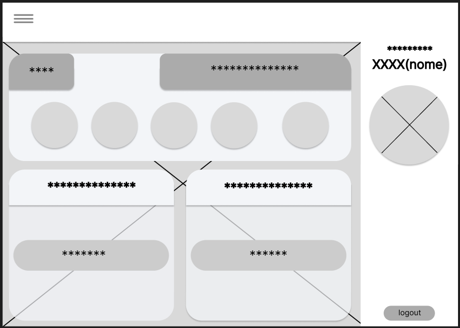
<sup>Fonte: Material produzido pelos autores (2024)</sup>
</div>

<div align="center">
<sub>Figura 16 - AUTOAVALIAÇÃO </sub>
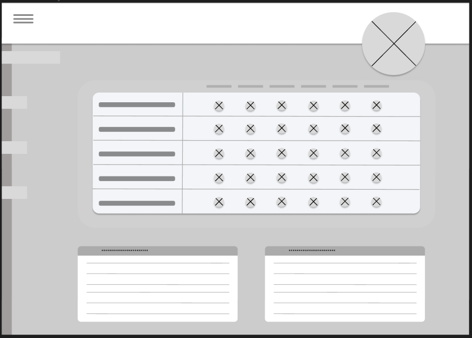
<sup>Fonte: Material produzido pelos autores (2024)</sup>
</div>

<div align="center">
<sub>Figura 17 - AVALIAÇÃO DE PARES </sub>
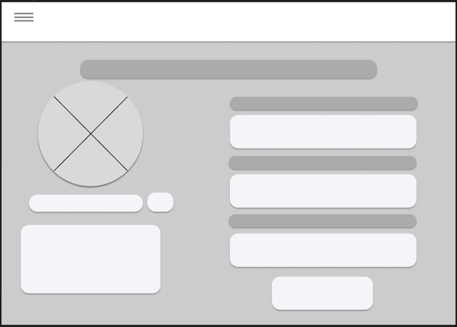
<sup>Fonte: Material produzido pelos autores (2024)</sup>
</div>

<div align="center">
<sub>Figura 18 - FEEDBACK </sub>
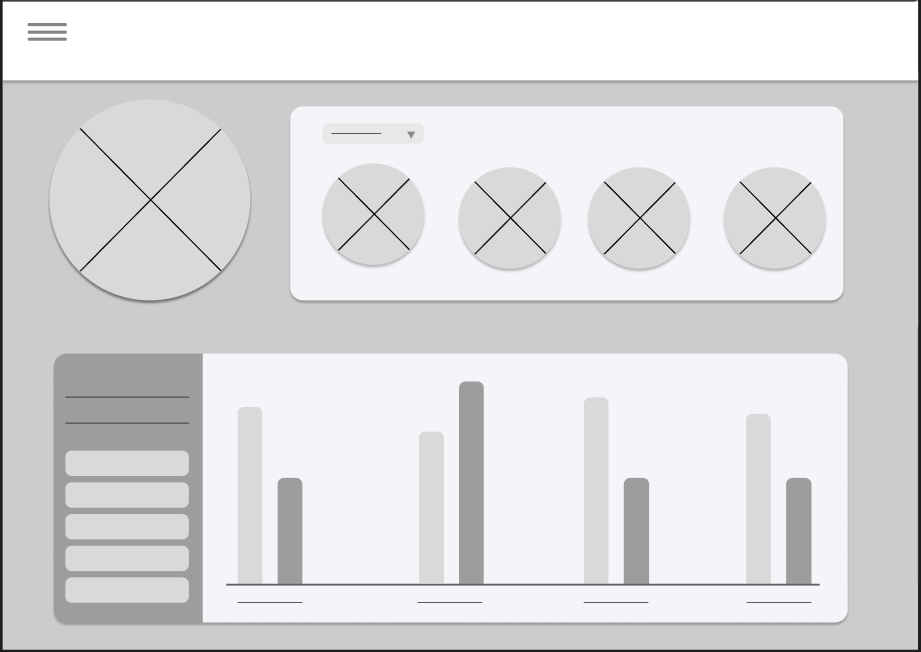
<sup>Fonte: Material produzido pelos autores (2024)</sup>
</div>

*https://www.figma.com/file/kJgfO5LRPxrXe8VUh58lQJ/Untitled?type=design&node-id=0%3A1&mode=design&t=CIrwbcYhO9WEXbda-1*

&nbsp;&nbsp;&nbsp;&nbsp;Em suma, os wireframes provaram ser uma ferramenta indispensável no processo de design da nossa aplicação web. Eles servirão como um guia visual ajudar a alinhar as expectativas da equipe e do cliente.

## 3.3. Guia de estilos 

&nbsp;&nbsp;&nbsp;&nbsp;O guia de estilos é criado a fim de centralizar, organizar e documentar todas as definições de design que serão utilizadas ao decorrer do projeto, a fim de padronizá-lo visualmente <sup>9</sup>. Isso garante a consistência do design e facilita a comunicação e a flexibilidade dos times, o que aumenta a produtividade e evita o desperdício de recursos e tempo. O guia de estilos é especialmente importante para o projeto, já que ele é baseado na metodologia ágil, a qual necessita de documentos que acompanhem a flexibilidade e eficiência do desenvolvimento.

<div align="center">
<sub>Figura 19 - Guia de estilos </sub>
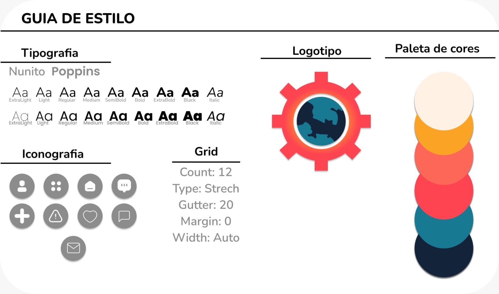
<sup>Fonte: Material produzido pelos autores (2024)</sup>
</div>

&nbsp;&nbsp;&nbsp;&nbsp;Ao produzir esse guia, foram definidas as cores, a tipografia, a iconografia e as imagens que serão utilizadas no decorrer do projeto. Tais aspectos foram detalhados mais aprofundadamente abaixo.

### 3.3.1 Cores

&nbsp;&nbsp;&nbsp;&nbsp;As cores exercem um papel crucial na concepção de interfaces. Elas são responsáveis por guiar ou afastar o olhar do usuário da página ou tela e, em grande parte, estão associadas aos conceitos de design. Sua função primordial consiste em delimitar espaços visuais, estruturar o conteúdo textual, garantir a legibilidade, realçar elementos e orientar a interação, entre outras tarefas<sup>13</sup>.

&nbsp;&nbsp;&nbsp;&nbsp;Inicialmente, foram produzidas 4 paletas que foram reunidas e apresentadas a todos os membros do grupo, para que todos pudessem ter um dizer em uma das partes mais importantes do projeto. A decisão da paleta de cores pode decidir a personalidade do website! Por isso, foi um processo extremamente cuidadoso.

<div align="center">
<sub>Figura 20 - 4 opções de paletas de cores que foram apresentadas ao grupo</sub>
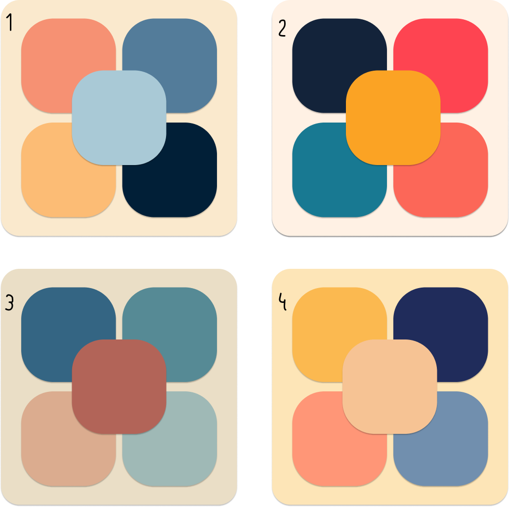
<sup>Fonte: Material produzido pelos autores (2024)</sup>
</div>

  No final, a paleta escolhida foi a número 2, e isso aconteceu porque ela carrega diversas qualidades, como:

**1. Contraste Equilibrado:** A paleta combina cores que possuem diferenças significativas em termos de luminosidade ou tonalidade. O azul escuro contrasta bem com as cores mais claras, como o vermelho e o laranja. Esse contraste equilibrado permite que cada cor se destaque sem dominar as outras.

**2. Cores Harmoniosas:** A combinação de cores segue princípios de harmonia. O azul e o laranja são cores complementares, posicionadas opostamente no círculo cromático. Essa harmonia cria uma sensação agradável para os olhos e sugere equilíbrio.

**3. Mix de Cores Dinâmico:** A presença do azul escuro, vermelho e laranja traz dinamismo à paleta. O azul representa estabilidade e calma, o vermelho evoca energia e atenção, enquanto o laranja traz calor e entusiasmo. Essa variedade de emoções pode cativar os usuários e mantê-los engajados. Já o tom do amarelo é frequentemente associado à energia, otimismo e alegria. Sua presença na paleta traz vitalidade e pode atrair a atenção dos usuários. Ele também pode evocar sentimentos de aconchego e conforto visto que o tom de amarelo é puxado para o vermelho, oque tras um tom mais terroso e aacolhedor.

**4. Calma e Aconchego:** A inclusão do azul e do vermelho também sugere calma e conforto. O azul é frequentemente associado à tranquilidade, enquanto o vermelho pode transmitir uma sensação . Essas qualidades são ideais para um website, onde os usuários desejam se sentir à vontade e confiantes.

**5. Versatilidade:** A paleta pode ser aplicada de forma coerente em diferentes contextos. Isso é importante para a consistência visual em um website. As cores podem ser usadas em botões, cabeçalhos, ícones e outros elementos, criando uma experiência unificada para os visitantes.

&nbsp;&nbsp;&nbsp;&nbsp;Em resumo, a escolha da paleta número 2 leva em consideração tanto os aspectos estéticos quanto os psicológicos das cores, resultando em uma seleção versátil e agradável para o usuário. 

<div align="center">
<sub>Figura 21 - Paleta de cores definitiva </sub>

<sup>Fonte: Material produzido pelos autores (2024)</sup>
</div>


<div align="center">
<sub>Figura 22 - Paleta de cores com hex </sub>
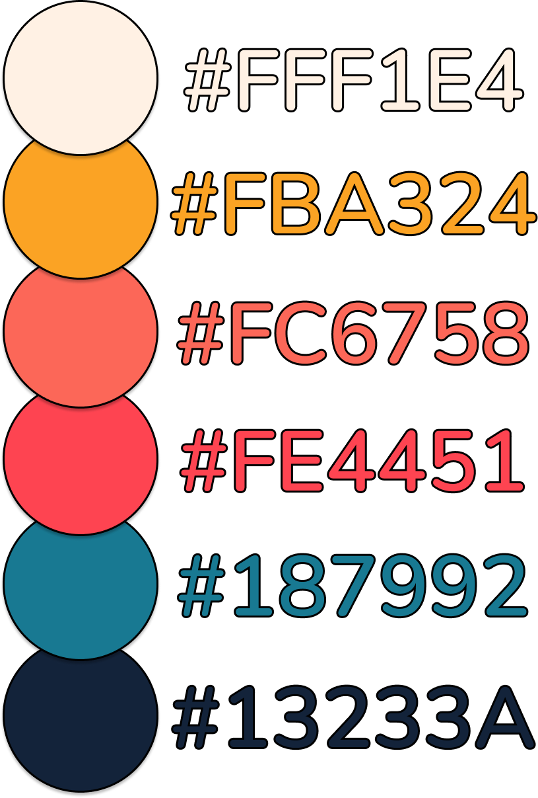
<sup>Fonte: Material produzido pelos autores (2024)</sup>
</div>

### 3.3.2 Tipografia

&nbsp;&nbsp;&nbsp;&nbsp;A tipografia estuda a criação e a aplicação das diferentes características das fontes de texto, como estilo, formato, distância entre caracteres e peso das letras<sup>10</sup>. A partir desse estudo, foi decidido que o website utilizará as fontes "Nunito" e "Poppins" para a estética geral dos textos, uma vez que "Nunito" é uma fonte da família 'Sans Serif' - a qual é mais recomendada para a legibilidade de sites -, enquanto "Poppins" é uma fonte tipográfica moderna e versátil, projetada para oferecer excelente legibilidade em uma ampla variedade de contextos. 

&nbsp;&nbsp;&nbsp;&nbsp;Também foi optado por utilizar espaçamento de 0 entre as linhas e espaçamento de 0% entre as letras, já que tais medidas tornam a leitura clara, sem haver sobreposição ou hiper separação de letras e linhas. A seguir, há uma imagem com todas as letras do alfabeto nas duas fontes e em diferentes estilos (normal, negrito e itálico) a fim de demonstrar suas possíveis visualizações. 


<div align="center">
<sub>Figura 23 - Tipografia </sub>
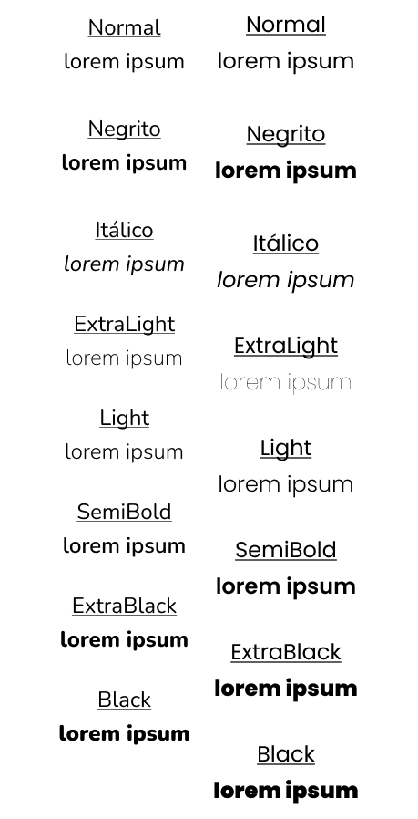
<sup>Fonte: Material produzido pelos autores (2024)</sup>
</div>

&nbsp;&nbsp;&nbsp;&nbsp;Para definir o tamanho da fonte, foi decidido que as seguintes métricas seriam aplicadas para padronizar as telas:

 <div align="center">
<sub>Tabela 16 - Tamanho de texto</sub>
 
Tipo de texto | Tamanho da fonte (px) 
---|---
Título (h1)| 60
Subtítulo (h2)| 40
Subtítulo (h3)| 32
Subtítulo (h4)| 26
Parágrafo| 16

<sup>Fonte: Material produzido pelos autores (2024)</sup>
</div>

&nbsp;&nbsp;&nbsp;&nbsp;Dessa forma, a tipografia se mostra importante para o objetivo do site, uma vez que o estilo das fontes pode mudar a dinâmica e o sentido do website, já que diferentes formas passam diferentes sentimentos e significados. Esse estudo também é essencial para a legibilidade e o contraste entre o corpo e os títulos, uma vez que tais fatores podem interferir a legibilidade e a intuitividade da página.

### 3.3.3 Iconografia e imagens 

&nbsp;&nbsp;&nbsp;&nbsp;Iconografia é um termo que diz a respeito da seleção, análise e posicionamento de símbolos que representam mensagens. Tais imagens devem ter sentidos convencionais ou fazer analogia ao seu significado para não confundir o usuário<sup>11</sup>. 

&nbsp;&nbsp;&nbsp;&nbsp;Abaixo, estão os ícones e suas derivações que fazem referência às diferentes telas do website. Cada um deles tem tamanho de 50X50 pixels e foram retirados da biblioteca do Figma chamada "Iconicool" <sup>12</sup>. Ao serem clicados, os ícones transportam o usuário da sua tela atual para a respectiva tela do ícone.

<div align="center">
<sub>Figura 24 - Ícones </sub>
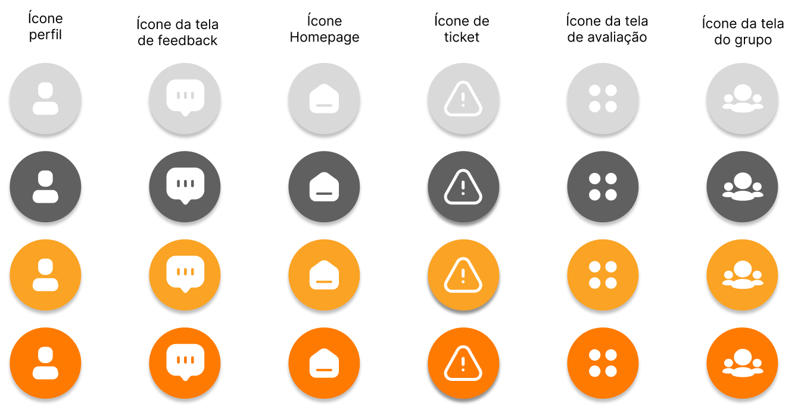
<sup>Fonte: Material produzido pelos autores (2024)</sup>
</div>

&nbsp;&nbsp;&nbsp;&nbsp; Também aplicou-se a logotipo de tamanho 50X50 na sidebar do site. Ela é composta por uma engrenagem, a qual representa a tecnologia, e por um globo da Terra, que faz analogia à diversidade cultural dos participantes do Cesim Game.

<div align="center">
<sub>Figura 25 - Imagem do Logotipo </sub>

<sup>Fonte: Material produzido pelos autores (2024)</sup>
</div>

&nbsp;&nbsp;&nbsp;&nbsp;A fim de enfatizar a diversidade e aumentar a ludicidade, a imagem a baixo foi escolhida como tela de fundo da página de login. Ela servirá para demonstrar os valores e objetivos da aplicação web, ou seja, ela deverá demonstrar a integração e o respeito entre as diferentes pessoas que provém de diversos contextos socioculturais. Essa imagem tem tamanho de 966X901 e pode ser observada a baixo:

<div align="center">
<sub>Figura 26 - Imagem de fundo da tela de login </sub>

<sup>Fonte: Material produzido pelos autores (2024)</sup>
</div>

&nbsp;&nbsp;&nbsp;&nbsp; Essa imagem foi escolhida para estar na primeira tela que o usuário tem contato após fazer seu login, já que o desenho do mapa mundi enfatiza a globalização e a diversidade de pessoas que estão participando do jogo. Essa imagem tem 645X348 pixels e pode ser observada a seguir:

<div align="center">
<sub>Figura 27 - Imagem da homepage </sub>

<sup>Fonte: Material produzido pelos autores (2024)</sup>
</div>

&nbsp;&nbsp;&nbsp;&nbsp; Por fim, utilizou-se uma imagem de duas pessoas discutindo na tela de tickets com o intuito de incentivar os usuários a comunicarem seus problemas de forma assertiva. Tal imagem possui tamanho de 484X460 pixels e pode ser vista abaixo:

<div align="center">
<sub>Figura 28 - Imagem da tela de tickets </sub>

<sup>Fonte: Material produzido pelos autores (2024)</sup>
</div>

&nbsp;&nbsp;&nbsp;&nbsp; Portanto, todas as imagens e ícones foram escolhidos e criados de acordo com a paleta de cores do website e com os valores de inclusão e diversidade, os quais são importantes para a comunicação e a integração dos membros de cada grupo.

### 3.3.4 Implementação do GRID no protótipo
&nbsp;&nbsp;&nbsp;&nbsp;Para melhorar a consistência visual, a organização e a flexibilidade do layout do protótipo de alta fidelidade no figma, implementou-se um sistema de grid. Esta abordagem visa facilitar tanto o desenvolvimento quanto a manutenção da interface do usuário, garantindo que todos os elementos estejam dispostos de forma ordenada e proporcional. Ou seja, ajuda na criação de uma tela visualmente coerente e responsiva.

&nbsp;&nbsp;&nbsp;&nbsp;Enquanto a estrutura do GRID optou-se por um sistema de 12 colunas, uma escolha comum que oferece a flexibilidade necessária para dividir o conteúdo de várias maneiras. As colunas são separadas por "gutters" (espaços entre as colunas) que mantêm um espaçamento adequado entre os elementos, enquanto as margens externas ao grid criam um respiro ao redor do conteúdo, melhorando a legibilidade e o equilíbrio visual. Na prática, o sistema de grid foi implementado em algumas páginas do protótipo, principalmente nas telas que apara essa sprint foi prioridade entregar, ajustando-as o layout para diferentes seções e componentes, dessa forma, algumas dessas telas são a home page, tela de login, tela de feedbacks e tickets.

<div align="center">
<sub>Figura 29 - GRID da tela de feedbacks</sub>
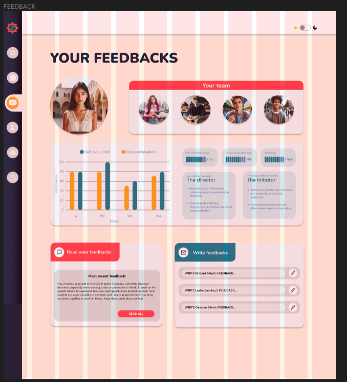
<sup>Fonte: Material produzido pelos autores (2024)</sup>
</div>

&nbsp;&nbsp;&nbsp;A implementação do sistema de grid no protótipo de alta fidelidade é um passo significativo na evolução do nosso design. Esta atualização não apenas melhora a usabilidade e a consistência visual, mas também reflete nosso compromisso com a excelência e a inovação contínua. 


## 3.4 Protótipo de alta fidelidade

&nbsp;&nbsp;&nbsp;&nbsp;Um protótipo de alta fidelidade é uma ferramenta importante no desenvolvimento de projetos web, representando uma simulação interativa que se assemelha muito ao produto final em termos de design, interatividade e navegação. Através portanto desse protótipo, é possível reduzir erros, otimizar recursos e garantir que o produto final seja não apenas funcional, mas também alinhado com as expectativas do usuário final. Com o intuito de produzir um protótipo de alta fidelidade, foi utilizada a plataforma "Figma". Abaixo, segue uma foto do protótipo e uma pequena descrição dos fluxos de telas:

<div align="center">
<sub>Figura 30 - Diagrama dos prototipos</sub>
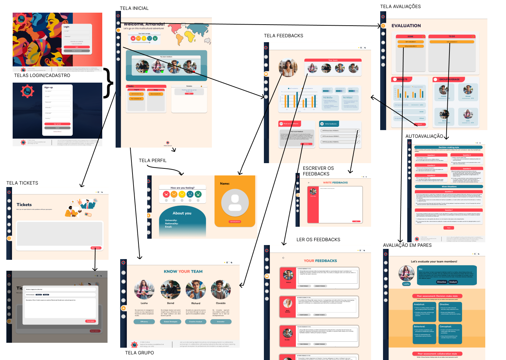
<sup>Fonte: Material produzido pelos autores (2024)</sup>
</div>

&nbsp;&nbsp;&nbsp;&nbsp;A fim de explorar melhor o protótipo, utilize o seguinte link para acessá-lo:
https://www.figma.com/file/kJgfO5LRPxrXe8VUh58lQJ/Prot%C3%B3tipo-de-alta-fidelidade?type=design&node-id=0%3A1&mode=design&t=mreEgyvxU3X3NeXy-1

&nbsp;&nbsp;&nbsp;&nbsp;O diagrama ilustra a interface e os fluxos de navegação do protótipo de alta fidelidade do projeto. A navegação entre as telas é primariamente conduzida através de uma barra lateral (sidebar), consistentemente posicionada à esquerda em todas as telas, onde cada ícone representa e permite o acesso direto a uma tela específica. Os ícones da sidebar redirecionam para as seguintes telas: avaliações, homepage, feedbacks, perfil, grupo e tickets, respectivamente.

&nbsp;&nbsp;&nbsp;&nbsp;Além da navegação pela sidebar, certas telas são acessíveis apenas através de botões específicos localizados em telas correlatas, adicionando uma camada de organização e acessibilidade focada. Por exemplo, as telas de 'Autoavaliação' e 'Avaliação em Pares' são exclusivamente acessíveis a partir da tela de 'Avaliação'. De forma similar, a tela de criação de 'Tickets' é acessível somente através da tela de 'Tickets'.

### 3.4.1 Tela de homepage
&nbsp;&nbsp;&nbsp;&nbsp;A tela de homepage possui um título de bem vindas com o nome do usuário para que ele tenha uma experiência personalizada. Logo abaixo está um medidor de felicidade, no qual o  usuário pode sinalizar seu humor através dos emojis. Logo, há uma área para que o usuário veja as tarefas que ele tem para fazer. Além disso, na direita da tela há um local para ver os horários das reuniões e acessá-las. 

### 3.4.2 Tela de avaliações
&nbsp;&nbsp;&nbsp;&nbsp;Na tela avaliações, há uma tabela para dividir as avaliações entre as categorias "a fazer" e "feito". Ao clicar no botão para realizar a autoavaliação, o estudante será redirecionado para o formulário, que será respondido para descobrir o seu estilo de liderança e de tomada de decisões. Cada formulário terá 6 e 7 perguntas, respectivamente.
Nessa mesma tela, há o botão "Avaliação de pares", que redirecionará o usuário para outra tela em que ele terá que avaliar o estilo de colaboração e de tomada de decisão dos colegas. Há 4 opções de estilos de colaboração:

- Analítico: pessoa que gosta de resolver problemas complexos de análise e inovação.
- Comportamental: indivíduo perssuasivo e empático, com grande entendimento da dinâmica do grupo.
- Detetive: pessoa que foca na rápida e independente tomada de decisões de acordo com as regras.
- Conceitual: indivíduo criativo que gosta de explorar novas possibilidade e considera impactos de longa duração.

&nbsp;&nbsp;&nbsp;&nbsp;Já na avaliação do estilo de tomada de decisões, há 5 categorias de personalidades a serem escolhidas:

- O diretor: Costumam ser vistos como líderes e tomadores de decisão e como aqueles que iniciam discussões com frequência. Como são motivados por resultados tangíveis e por atingir metas dentro do prazo e do orçamento, eles têm um dom natural para assumir responsabilidades e cumpri-las.

- O conformista: É uma pessoa que gosta de seguir as regras e procedimentos aceitos para evitar conflitos internos e externos. Essa pessoa provavelmente tende a ser bastante cooperativa no trabalho com sua equipe imediata, mas parece ser menos cooperativa no ambiente de equipe maior. Devido à característica de evitar conflitos, eles realmente não gostam de receber feedback de seus colegas, tentam evitar a negatividade e podem ter problemas para expressar abertamente seu desacordo.

- O harmonizador: É a pessoa que mantém todos unidos e é conhecido por construir ótimos relacionamentos e facilitar as interações em equipe. Preza pela cooperação genuína e faz um esforço extra para dar apoio e garantir que as opiniões de todos sejam ouvidas

- O iniciador: Eles trazem variedade e podem facilmente ver o panorama geral de tudo o que fazem. Apresentam grandes ideias e abrem a discussão para que todos possam explorar novos territórios juntos. Por serem motivados por novidades e novas invenções, eles não são estranhos a pensar fora da caixa, buscando constantemente meios externos de inspiração ou criatividade.

- O analista: Eles adoram mergulhar em um problema complexo e desmontá-lo de todas as maneiras até que a resposta seja encontrada. São conhecidos por serem extremamente analíticos e preferem lidar com o trabalho de forma linear, em ordem sequencial – terminando uma coisa antes de começar outra. Por serem motivados pelos dados e pela precisão deles, eles são muito orientados para os processos e preferem reservar um tempo para refletir sobre novas ideias e pensamentos.

&nbsp;&nbsp;&nbsp;&nbsp;Além dos formulários para preencher, no final da página há uma área que é possível ver o resumo das pontuações do usuário e dos seus colegas em um gráfico. Para ver maiores detalhes, o usuário pode clicar na página de feedbacks.


### 3.4.3 Tela de feedbacks e grupos
&nbsp;&nbsp;&nbsp;&nbsp;Na tela de feedbacks, há um detalhamento maior dos feedbacks. É possível ver um gráfico com a comparação das notas das autoavaliações e da avaliação de pares durante as diferentes rodadas e o resultado do estilo de lideraça e de tomada de decisões do usuário. Nessa tela, também há um local para escrever feedbacks discursivos para seus colegas e ver os feedbacks que foram escritos para o usuário.

&nbsp;&nbsp;&nbsp;&nbsp;Além disso, há um local chamado "time", que possui as fotos dos membros do grupo. Quando o mouse passa pelas fotos, é mostrado o medidor de felicidade de cada um dos membros. Caso a caixa "time" já clicada, o usuário será redirecionado para a tel "Grupo", onde há a descrição da personalidade de cada colega.

### 3.4.4 Tela de perfil
&nbsp;&nbsp;&nbsp;&nbsp;Na tela de perfil, há a foto e as informações pessoais do usuário que foram obtidas durante o cadastro. Essa área permite que o usuário faça o upload de uma foto de perfil. Também há uma seção intitulada "About you", onde são exibidas informações adicionais como Universidade, Nacionalidade e Email. Além disso, há uma área para adicionar novas informações pessoais, como qualidades e particularidades, a fim de que os colegas de grupo possam conhecer melhor o usuário. A tela também inclui um medidor de felicidade interativo, onde o usuário pode selecionar um dos cinco estados emocionais disponíveis, refletidos por ícones de diferentes expressões faciais. Este medidor será disponibilizado para os outros membros do time, permitindo uma melhor compreensão do estado emocional do usuário.

### 3.4.5 Tela de tickets
&nbsp;&nbsp;&nbsp;&nbsp;Há uma tela de tickets, onde é possível abrir tickets para resolver conflitos internos. Para tal, é necessário escrever o assunto e a descrição do problema e mencionar as pessoas envolvidas no conflito. Após postar o ticket, uma notificação será enviada para os envolvidos a fim de facilitar a comunicação entre os membros.

&nbsp;&nbsp;&nbsp;&nbsp;Portanto, o protótipo de alta fidelidade de mostra essencial para a visualização do fluxo de telas, a composição estética e a distribuição de elementos e componentes uniformemente na página. Tal ferramenta economiza tempo e recursos, já que define e reajusta o layout da página antes de começar o frontend e backend.


## 3.5. Modelagem do banco de dados 

### 3.5.1. Modelo relacional 

&nbsp;&nbsp;&nbsp;&nbsp;A estruturação do banco de dados relacional foi realizada com base nos requisitos sugeridos pelo parceiro e nos requisitos sugeridos também pelo grupo, fazendo com que a relação entre as tabelas faça sentido, incluindo todos os campos das User Stories e telas do site prototipado.  

<div align="center">
<sub>Figura 31 - Modelagem relacional do banco de dados</sub>
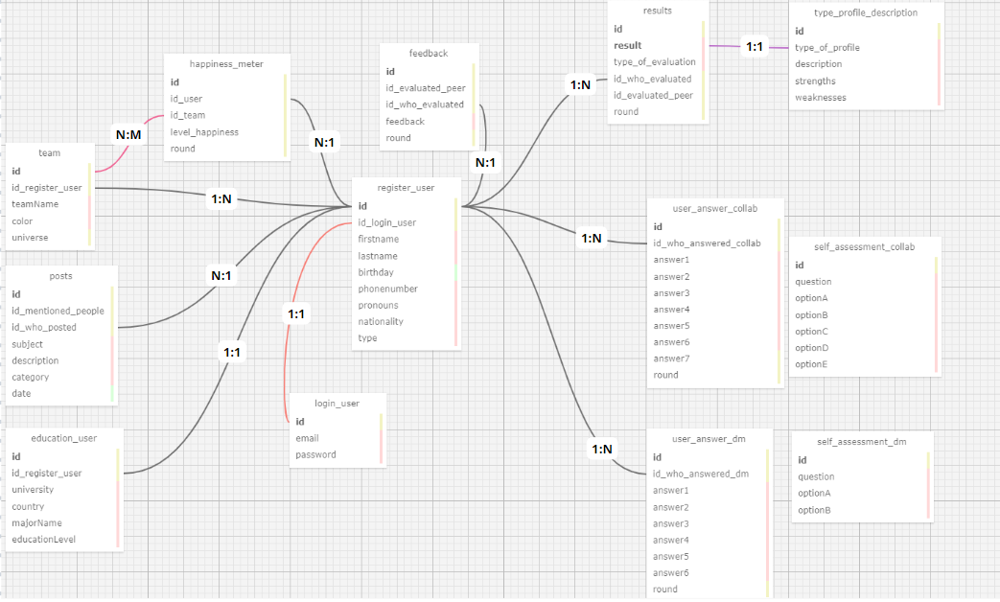
<sup>Fonte: Material produzido pelos autores (2024)</sup>
</div>

- **Entidade:** 
  - <code>register_user</code>: entidade utilizada para guardar dados do usuário. Todos os atributos dessa entidade serão inseridos no banco de dados no ato de cadastro na plataforma.

- **Atributos:** 
  - <code>id</code>: chave de identificação dos dados. Utilizada como chave primária para consultas ao banco. Esse atributo será chave estrangeira nas entidades <code>education_user</code>, <code>posts</code>, <code>team</code>, <code>happiness_meter</code>, <code>feedback</code>, <code>results</code>, <code>user_answer_dm</code> e <code>user_answer_collab</code>.
  - <code>login_user</code>: esse atributo será uma chave estrangeira provinda da entidade <code>login_user</code> em uma relação de um para um, já que haverá um login por cada pessoa cadastrada.
  - <code>firstname</code>: armazena o primeiro nome do usuário. Essa informação será utilizada, principalmente, na tela de perfil e nas telas de avaliação (autoavaliação, avaliação de pares e feedback).
  - <code>lastname</code>: armazena o último nome do usuário, para fins de identificação. Será impresso na área de boas vindas da tela de perfil.
  - <code>birthday</code>: armazena a data de nascimento do usuário.
  - <code>phonenumber</code>: armazena o telefone do estudante, apenas para fins de cadastro.
  - <code>pronouns</code>: armazena os pronomes do estudante, apenas para fins de cadastro.
  - <code>nationality</code>: armazena a nacionalidade do estudante. Essa informação será mostrada na tela de time, que tem como principal funcionalidade apresentar ao usuário os seus teammates.
  - <code>type</code>: armazena o tipo de usuário, se ele é tutor ou estudante. A depender da resposta, verifica o tipo de acesso ao site.


- **Entidade:** 
  - <code>login_user</code>: entidade utilizada para guardar os dados do usuário de login do usuário que foram inseridos no cadastro.

- **Atributos:** 
  - <code>id</code>: chave de identificação dos dados. Utilizada como chave primária para consultas ao banco. 
  - <code>email</code>: armazena o email do usuário, necessário para fazer login na página.
  - <code>password</code>: armazena a senha de acesso ao usuário, sendo, também, necessária para fazer login.


- **Entidade:**
  - <code>education</code>: entidade que possui os dados educacionais do usuário.

- **Atributos:**
  - <code>id</code>: chave de identificação dos dados. Utilizada como chave primária para consultas ao banco. 
  - <code>id_register_user</code>: chave estrangeira oriunda da entidade "register_user", esse atributo retorna o id do usuário, sendo usado para relacionar as duas entidades ("register_user" e "education_user"). Aqui, a relação de cardinalidade de <code>id_register_user</code> e <code>id</code> é de um para um, ou seja, cada id de usuário se relaciona a apenas um campo de 'educação'.
  - <code>university</code>: armazena o nome da universidade participante do jogo, informação essa que será mostrada aos usuários na tela de time, a fim de que eles saibam onde os seus teammates estudam.
  - <code>country</code>: armazena o nome do país no qual se localiza a universidade em questão, informação essa que também será mostrada aos usuários na tela de perfil de cada membro do seu grupo, junto da informação com o nome da universidade.
  - <code>majorName</code>: armazena o nome do curso que o usuário faz ou leciona, informação que também será mostrada na tela de perfil de cada membro do time, junto das demais informações educacionais.
  - <code>educationLevel</code>: armazena o nível da graduação (major, minnor, graduação, pós-graduação, etc), informação que também será mostrada no perfil.


- **Entidade:**
  - <code>team</code>: entidade utilizada para organizar a separação dos times participantes do jogo, permitindo a separação dos alunos em times.

- **Atributos:** 
  - <code>id</code>: chave de identificação dos dados. Utilizada como chave primária para consultas ao banco. Nesse caso, será utilizada como chave estrangeira nas entidades <code>happiness_meter</code>.
  - <code>id_register_user</code>: chave estrangeira oriunda da entidade "register_user", esse atributo retorna o id do usuário, sendo usado para relacionar as duas entidades ("register_user" e "team"). Aqui, a relação de cardinalidade é de um para muitos, ou seja, cada time pode ter muitos usuários.
  - <code>teamName</code>: armazena o nome do time, a ser exibido na tela de time da aplicação.
  - <code>color</code>: indica a cor associada a cada time, para facilitar a sua identificaçã visual no frontend do website.
  - <code>universe</code>: indica de qual universo será cada time.


- **Entidade:**
  - <code>happiness_meter</code>: entidade criada para armazenar o nível de satisfação de cada membro do grupo em relação ao próprio time.

- **Atributos:**
  - <code>id</code>: chave de identificação dos dados. 
  - <code>id_user</code>: chave estrangeira oriunda da entidade <code>register_user</code>, esse atributo é responsável por retornar o id de cada usuário. Assim, a relação de cardinalidade é de muitos para um, visto que um usuário pode ter muitos medidores de felicidade ao decorrer das rodadas.
  - <code>id_team</code>: chave estrangeira oriunda da entidade <code>team</code>, esse atributo é responsável por retornar o id do time. Assim, a relação de cardinalidade de <code>team</code> para <code>happiness_meter</code> é de muitos para muitos, visto que vários times podem ter diversos medidores de felicidade ao longo das rodadas.
  - <code>level_happiness</code>: armazena um valor numérico inteiro (de 1 a 5) que representa o nível de satisfação de um determinado usuário com o time num todo.
  - <code>round</code>: indica o round em que a avaliação de satisfação ocorreu.
  

- **Entidade:**
  - <code>self_assessment_collab</code>: entidade criada para armazenar os enunciados e os itens de respostas para o questionário da autoavaliaçãodo estilo de colaboração.

- **Atributos:**
  - <code>id</code> chave de identificação dos dados. 
  - <code>question</code>: armazena o enunciado das perguntas.
  - <code>optionA</code>: atributo que armazenará o texto da opção A para uma pergunta da <code>question</code>.
  - <code>optionb</code>: atributo que armazenará o texto da opção B para uma pergunta da <code>question</code>.
  - <code>optionC</code>: atributo que armazenará o texto da opção C para uma pergunta da <code>question</code>.
  - <code>optionD</code>: atributo que armazenará o texto da opção D para uma pergunta da <code>question</code>.
  - <code>optionE</code>: atributo que armazenará o texto da opção E para uma pergunta da <code>question</code>.


  - **Entidade:**
  - <code>self_assessment_dm</code>: entidade criada para armazenar os enunciados e os itens de respostas para o questionário de autoavaliação sobre o estilo de tomada de decisão.

- **Atributos:**
  - <code>id</code> chave de identificação dos dados. 
  - <code>question</code>: armazena o enunciado das perguntas.
  - <code>optionA</code>: atributo que armazenará o texto da opção A para uma pergunta da <code>question</code>.
  - <code>optionb</code>: atributo que armazenará o texto da opção B para uma pergunta da <code>question</code>.


- **Entidade:** 
  - <code>type_profile_description</code>: entidade pensada para armazenar os tipo de perfis das avaliação de colaboração e tomada de decisões, sua explicação, fraquezas e forças. 

- **Atributos:**
  - <code>id</code>: chave de identificação dos dados.
  - <code>type_of_profile</code>: chave estrangeira oriunda da entidade <code>results</code>, esse atributo indica o tipo de perfis em relação à colaboração e à tomada de decisões. A cardinalidade nessa relação é de um para um, visto que há apenas um tipo de perfil por resultado.
  - <code>description</code>: armazena a explicação do tipo de perfil.
  - <code>strengths</code>: Indica as forças de cada perfil.
  - <code>weaknesses</code>: Indica as fraquezas de cada perfil.


- **Entidade:**
  - <code>user_answer_collab</code>: entidade pensada para armazenar as respostas das perguntas do questionário de colaboração.

- **Atributos:**
  - <code>id</code>: chave de identificação dos dados. Utilizada como chave primária para consultas ao banco. 
  - <code>id _who_answered_collab</code>: é uma chave estrangeira advinda da entidade <code>register_user</code> para saber de quem são as respostas armazenadas. A cardinalidade entre <code>register_user</code> e <code>user_answer_collab</code> é de um para muitos, visto que há muitas respostas por cada usuário. 
  - <code>answer1</code>: armazena a um caractere (A, B, C, D ou E) que indica qual resposta foi dada para a questão 1.
  - <code>answer2</code>: armazena a um caractere (A, B, C, D ou E) que indica qual resposta foi dada para a questão 2.
  - <code>answer3</code>: armazena a um caractere (A, B, C, D ou E) que indica qual resposta foi dada para a questão 3.
  - <code>answer4</code>: armazena a um caractere (A, B, C, D ou E) que indica qual resposta foi dada para a questão 4.
  - <code>answer5</code>: armazena a um caractere (A, B, C, D ou E) que indica qual resposta foi dada para a questão 5.
  - <code>answer6</code>: armazena a um caractere (A, B, C, D ou E) que indica qual resposta foi dada para a questão 6.
  - <code>answer7</code>: armazena a um caractere (A, B, C, D ou E) que indica qual resposta foi dada para a questão 7.
  - <code>round</code>: indica o round em que a avaliação foi respondida.


- **Entidade:**
  - <code>user_answer_collab</code>: entidade pensada para armazenar as respostas das perguntas do questionário de tomada de decisão.

- **Atributos:**
  - <code>id</code>: chave de identificação dos dados. Utilizada como chave primária para consultas ao banco. 
  - <code>id _who_answered_collab</code>: é uma chave estrangeira advinda da entidade <code>register_user</code> para saber de quem são as respostas armazenadas.
  A cardinalidade entre <code>register_user</code> e <code>user_answer_dm</code> é de um para muitos, visto que há muitas respostas para cada usuário. 
  - <code>answer1</code>: armazena a um caractere (A ou B) que indica qual resposta foi dada para a questão 1.
  - <code>answer2</code>: armazena a um caractere (A ou B) que indica qual resposta foi dada para a questão 2.
  - <code>answer3</code>: armazena a um caractere (A ou B) que indica qual resposta foi dada para a questão 3.
  - <code>answer4</code>: armazena a um caractere (A ou B) que indica qual resposta foi dada para a questão 4.
  - <code>answer5</code>: armazena a um caractere (A ou B) que indica qual resposta foi dada para a questão 5.
  - <code>answer6</code>: armazena a um caractere (A ou B) que indica qual resposta foi dada para a questão 6.
  - <code>round</code>: indica o round em que a avaliação foi respondida.


- **Entidade:**
  - <code>results</code>: entidade criada para armazenar os resultado do perfil do usuário que foi traçado a partir das suas respostas.

- **Atributos:**
  - <code>id</code>: chave de identificação dos dados. Utilizada como chave primária para consultas ao banco. 
  - <code>results</code>: armazena o resultado do tipo de perfil.
  - <code>type_of_evaluation</code>: indica se o resultado é oriundo da autoavaliação ou da avaliação de pares.
  - <code>id_who_evaluated</code>: é uma chave estrangeira que provem da entidade <code>register_user</code>. Ela indica quem respondeu o questionário. A relação de cardinalidade é de um para muitos, já que um usuário possui muitos resultados.
  - <code>id_evaluated_peer</code>: caso <code>type_of_evaluation</code> seja 'avaliação de pares', esse campo indica o id de quem foi avaliado pela pessoa que respondeu o questionário. Em uma autoavaliação, esse campo aceita 'Null'.
  - <code>round</code>: indica o round da resposta.


- **Entidade:**
  - <code>feedback</code>: entidade criada para armazenar os feedbacks dados pelos usuários aos seus colegas de time.

- **Atributos:**
  - <code>id</code>: chave de identificação dos dados. Utilizada como chave primária para consultas ao banco.
  - <code>id_evaluated_peer</code>: esse atributo é responsável por salvar a identificação do membro do time que irá receber o feedback.
  - <code>id_who_evaluated</code>: chave estrangeira oriunda da entidade <code>register_user</code>, esse atributo é responsável por salvar a identificação do usuário que está dando o feedback. A realção de cardinalidade é de um para muitos, já que um usuário pode fazer vários feedbacks.
  - <code>feedback</code>: armazena o feedback dado pelo usuário aos seus respectivos colegas de grupo.
  - <code>round</code>: indica o round que o feedback foi dado.


- **Entidade:**
  - <code>posts</code>: entidade pensada para armazenar as informações das postagens que serão feitas na tela 'Posts'

- **Atributos:**
  - <code>id</code>: chave de identificação dos dados. Utilizada como chave primária para consultas ao banco.
  - <code>id_mentioned_people</code>: armazena o id das pessoas que foram mencionadas na postagem.
  - <code>id_who_posted</code>: chave estrangeira oriunda da entidade <code>register_user</code>. Esse atributo é pensado para indicar quem está fazendo a postagem. Aqui, a relação de cardinalidade é de muitos para um, visto que o usuário é apenas um, mas pode fazer muitas postagens.


#### - Modelo físico do banco de dados:

```
CREATE TABLE team (
    id SERIAL PRIMARY KEY,
    id_register_user INTEGER,
    teamName TEXT,
    color VARCHAR,
    universe INTEGER,
    FOREIGN KEY (id_register_user) REFERENCES register_user(id)
);

CREATE TABLE register_user (
    id SERIAL PRIMARY KEY,
    id_login_user INTEGER,
    firstname VARCHAR,
    lastname VARCHAR,
    birthday DATE,
    phonenumber TEXT,
    pronouns VARCHAR,
    nationality VARCHAR,
    type VARCHAR,
    FOREIGN KEY (id_login_user) REFERENCES login_user(id)
);

CREATE TABLE self_assessment_dm (
    id SERIAL PRIMARY KEY,
    question VARCHAR,
    optionA TEXT,
    optionB VARCHAR
);

CREATE TABLE education_user (
    id SERIAL PRIMARY KEY,
    id_register_user INTEGER,
    university VARCHAR,
    country VARCHAR,
    majorName VARCHAR,
    educationLevel VARCHAR,
    FOREIGN KEY (id_register_user) REFERENCES register_user(id)
);

CREATE TABLE feedback (
    id SERIAL PRIMARY KEY,
    id_evaluated_peer INTEGER,
    id_who_evaluated INTEGER,
    feedback CHAR,
    round INTEGER,
    FOREIGN KEY (id_who_evaluated) REFERENCES register_user(id)
);

CREATE TABLE posts (
    id SERIAL PRIMARY KEY,
    id_mentioned_people INTEGER,
    id_who_posted INTEGER,
    subject CHAR,
    description CHAR,
    category VARCHAR,
    date DATE,
    FOREIGN KEY (id_who_posted) REFERENCES register_user(id)
);

CREATE TABLE self_assessment_collab (
    id SERIAL PRIMARY KEY,
    question TEXT,
    optionA VARCHAR,
    optionB VARCHAR,
    optionC VARCHAR,
    optionD VARCHAR,
    optionE VARCHAR
);

CREATE TABLE login_user (
    id SERIAL PRIMARY KEY,
    email VARCHAR,
    password VARCHAR
);

CREATE TABLE results (
    id SERIAL PRIMARY KEY,
    result VARCHAR,
    type_of_evaluation VARCHAR,
    id_who_evaluated INTEGER,
    id_evaluated_peer INTEGER,
    round INTEGER,
    FOREIGN KEY (id_who_evaluated) REFERENCES register_user(id)
);

CREATE TABLE user_answer_collab (
    id SERIAL PRIMARY KEY,
    id_who_answered_collab INTEGER,
    answer1 CHAR,
    answer2 CHAR,
    answer3 CHAR,
    answer4 CHAR,
    answer5 CHAR,
    answer6 CHAR,
    answer7 INTEGER,
    round INTEGER
);

CREATE TABLE user_answer_dm (
    id SERIAL PRIMARY KEY,
    id_who_answered_dm INTEGER,
    answer1 CHAR,
    answer2 CHAR,
    answer3 CHAR,
    answer4 CHAR,
    answer5 CHAR,
    answer6 CHAR,
    round INTEGER
);

CREATE TABLE happiness_meter (
    id SERIAL PRIMARY KEY,
    id_user INTEGER,
    id_team INTEGER,
    level_happiness INTEGER,
    round INTEGER,
    FOREIGN KEY (id_user) REFERENCES register_user(id),
    FOREIGN KEY (id_team) REFERENCES team(id)
);

CREATE TABLE type_profile_description (
    id SERIAL PRIMARY KEY,
    type_of_profile VARCHAR,
    description VARCHAR,
    strengths VARCHAR,
    weaknesses VARCHAR
);

```

* O documento com o modelo físico está disponível em <code>documentos/assets/bancoDeDados.sql</code>
* O documento <code>.xml</code> está disponível em <code>documentos/assets/bancoDeDados.xml</code>


&nbsp;&nbsp;&nbsp;&nbsp;Portanto, a estruturação do banco de dados relacional, como apresentado na figura 11, reflete uma cuidadosa análise dos requisitos propostos pelo parceiro e pelo grupo, garantindo que a relação entre as tabelas seja coesa e atenda às necessidades das User Stories e das telas do site prototipado. Cada entidade e atributo foram planejados visando garantir uma integração eficiente e uma manipulação mais prática dos dados. Essa modelagem proporciona uma base para o desenvolvimento e implementação do sistema, assegurando uma experiência satisfatória para os usuários.

### 3.5.2. Consultas SQL e lógica proposicional 
&nbsp;&nbsp;&nbsp;&nbsp; As consultas SQL (Structured Query Language) são utilizadas para interagirem com o banco de dados. Essas consultas permitem alterações nas tabelas, como exclusões, atualizações e inserções no banco de dados. Dessa forma, é uma linguagem padrão para o banco de dados que envolvem armazenamento e recuperação de dados estruturados.
<br>
&nbsp;&nbsp;&nbsp;&nbsp;A lógica proposicional é um ramo da lógica matemática que lida com a análise e manipulação de proposições, ou seja, declarações que podem ser verdadeiras ou falsas. Portanto, quando se trata de manipular dados em bancos de dados, ela é utilizada para formular consultas precisas que retornem os resultados desejados.
<br>

<div align="center">
<sub>Tabela 17 - Primeira consulta SQL</sub>


#1 | Tabela 17 - Consulta SQL
--- | ---
**Expressão SQL** | SELECT * FROM education_user WHERE NOT ( university = 'Inteli' AND educationName = 'Ciências da computação'); 
**Proposições lógicas** | $A$: A universidade é 'Inteli' (university = 'Inteli') <br> $B$: O curso é ciências da computação (educationName = 'Ciências da computação')
**Expressão lógica proposicional** | $\neg (A \land B)$
**Tabela Verdade** | <table> <thead> <tr> <th>$A$</th> <th>$B$</th> <th>$(A \land B)$</th> <th>$\neg (A \land B)$</th> </tr> </thead> <tbody> <tr> <td>F</td> <td>F</td> <td>F</td> <td>V</td> </tr> <tr> <td>F</td> <td>V</td> <td>F</td> <td>V</td> </tr> <tr> <td>V</td> <td>F</td> <td>F</td> <td>V</td> </tr> <tr> <td>V</td> <td>V</td> <td>V</td> <td>F</td> </tr> </tbody> </table>

<sup>Fonte: Material produzido pelos autores (2024)</sup>
</div>

- Primeira linha: $A$ é falso e $B$ é falso.
  - $(A \land B)$ é falso, porque nenhum dos dois é verdadeiro.
  - $\neg (A \land B)$ é verdadeiro, porque a negação de falso é verdadeiro.

- Segunda linha: $A$ é falso e $B$ é verdadeiro.
  - $(A \land B)$ é falso, porque $A$ é falso.
  - $\neg (A \land B)$ é verdadeiro, porque a negação de falso é verdadeiro.

- Terceira linha: $A$ é verdadeiro e $B$ é falso.
  - $(A \land B)$ é falso, porque $B$ é falso.
  - $\neg (A \land B)$ é verdadeiro, porque a negação de falso é verdadeiro.

- Quarta linha: $A$ é verdadeiro e $B$ é verdadeiro.
  - $(A \land B)$ é verdadeiro, porque ambos $A$ e $B$ são verdadeiros.
  - $\neg (A \land B)$ é falso, porque a negação de verdadeiro é falso.

&nbsp;&nbsp;&nbsp;&nbsp; Esta expressão SQL filtra todos os estudantes, menos os estudantes do Inteli que cursam Ciências da computação, a consulta evita a necessidade de listar todas as outras combinações possíveis que a pessoa deseja incluir, simplificando a lógica e a implementação da consulta no banco de dados. Isso facilita a pesquisa por determinadas faculdades, principalmente se você não quer listar as de um determinado curso e faculdades específicas.
<br>
&nbsp;&nbsp;&nbsp;&nbsp;Portanto, a lógica proposicional e a tabela verdade nos ajudam a entender que a consulta SQL retorna todos os registros que não atendem à condição de ter tanto a universidade 'Inteli' quanto o curso 'Ciências da computação'.
<br>
<br>

<div align="center">
<sub>Tabela 18 - Segunda consulta SQL</sub>

#2 | Tabela 18 - Consulta SQL
--- | ---
**Expressão SQL** | UPDATE usuario SET password = 'hashedNewPassword' WHERE ( ID = 'id' OR email = 'user@example.com' ) AND active = true;
**Proposições lógicas** | $A$: O ID é 'id' (ID = 'id') <br> $B$: O email é 'user@example.com' (email = 'user@example.com') <br> $C$: A conta está ativa (active = true)
**Expressão lógica proposicional** | $(A \lor B) \land C$
**Tabela Verdade** | <table> <thead> <tr> <th>$A$</th> <th>$B$</th> <th>$C$</th> <th>$(A \lor B)$</th> <th>$(A \lor B) \land C$</th> </tr> </thead> <tbody> <tr> <td>F</td> <td>F</td> <td>F</td> <td>F</td> <td>F</td> </tr> <tr> <td>F</td> <td>F</td> <td>V</td> <td>F</td> <td>F</td> </tr> <tr> <td>F</td> <td>V</td> <td>F</td> <td>V</td> <td>F</td> </tr> <tr> <td>F</td> <td>V</td> <td>V</td> <td>V</td> <td>V</td> </tr> <tr> <td>V</td> <td>F</td> <td>F</td> <td>V</td> <td>F</td> </tr> <tr> <td>V</td> <td>F</td> <td>V</td> <td>V</td> <td>V</td> </tr> <tr> <td>V</td> <td>V</td> <td>F</td> <td>V</td> <td>F</td> </tr> <tr> <td>V</td> <td>V</td> <td>V</td> <td>V</td> <td>V</td> </tr> </tbody> </table>

<sup>Fonte: Material produzido pelos autores (2024)</sup>
</div>

- Primeira linha: $A$ é falso, $B$ é falso e $C$ é falso.
  - $(A \lor B)$ é falso, porque nenhum dos dois é verdadeiro.
  - $(A \lor B) \land C$ é falso, porque $(A \lor B)$ é falso.

- Segunda linha: $A$ é falso, $B$ é falso e $C$ é verdadeiro.
  - $(A \lor B)$ é falso, porque nenhum dos dois é verdadeiro.
  - $(A \lor B) \land C$ é falso, porque $(A \lor B)$ é falso.

- Terceira linha: $A$ é falso, $B$ é verdadeiro e $C$ é falso.
  - $(A \lor B)$ é verdadeiro, porque $B$ é verdadeiro.
  - $(A \lor B) \land C$ é falso, porque $C$ é falso.

- Quarta linha: $A$ é falso, $B$ é verdadeiro e $C$ é verdadeiro.
  - $(A \lor B)$ é verdadeiro, porque $B$ é verdadeiro.
  - $(A \lor B) \land C$ é verdadeiro, porque ambos $(A \lor B)$ e $C$ são verdadeiros.

- Quinta linha: $A$ é verdadeiro, $B$ é falso e $C$ é falso.
  - $(A \lor B)$ é verdadeiro, porque $A$ é verdadeiro.
  - $(A \lor B) \land C$ é falso, porque $C$ é falso.

- Sexta linha: $A$ é verdadeiro, $B$ é falso e $C$ é verdadeiro.
  - $(A \lor B)$ é verdadeiro, porque $A$ é verdadeiro.
  - $(A \lor B) \land C$ é verdadeiro, porque ambos $(A \lor B)$ e $C$ são verdadeiros.

- Sétima linha: $A$ é verdadeiro, $B$ é verdadeiro e $C$ é falso.
  - $(A \lor B)$ é verdadeiro, porque pelo menos um dos dois ($A$ ou $B$) é verdadeiro.
  - $(A \lor B) \land C$ é falso, porque $C$ é falso.

- Oitava linha: $A$ é verdadeiro, $B$ é verdadeiro e $C$ é verdadeiro.
  - $(A \lor B)$ é verdadeiro, porque pelo menos um dos dois ($A$ ou $B$) é verdadeiro.
  - $(A \lor B) \land C$ é verdadeiro, porque ambos $(A \lor B)$ e $C$ são verdadeiros.

&nbsp;&nbsp;&nbsp;&nbsp; Essa lógica SQL atualiza a senha se o ID ou o email corresponder a uma conta já ativa. Além disso, a expressão combina condições com OR e AND, o que permite uma atualização mais precisa e controlada dos registros. Isso é extremamente útil quando as condições não são mutuamente exclusivas, ademais essa expressão garante que apenas as contas ativas sejam possíveis de atualizar a senha. 
<br>
&nbsp;&nbsp;&nbsp;&nbsp;Logo, sem a combinação das condições, a atualização poderia ser menos segura e menos precisa, potencialmente afetando mais registros do que o desejado.
<br>
<br>

<div align="center">
<sub>Tabela 19 - Terceira consulta SQL</sub>


#3 | Tabela 19 - Consulta SQL
--- | ---
**Expressão SQL** | DELETE FROM usuario WHERE id IN (123, 456, 789) AND email LIKE '%example.com';
**Proposições lógicas** | $A$: O ID está na lista (id IN (123, 456, 789)) <br> $B$: O email contém 'example.com' (email LIKE '%example.com')
**Expressão lógica proposicional** | $A \land B$
**Tabela Verdade** | <table> <thead> <tr> <th>$A$</th> <th>$B$</th> <th>$A \land B$</th> </tr> </thead> <tbody> <tr> <td>F</td> <td>F</td> <td>F</td> </tr> <tr> <td>F</td> <td>V</td> <td>F</td> </tr> <tr> <td>V</td> <td>F</td> <td>F</td> </tr> <tr> <td>V</td> <td>V</td> <td>V</td> </tr> </tbody> </table>

<sup>Fonte: Material produzido pelos autores (2024)</sup>
</div>

- Primeira linha: $A$ é falso e $B$ é falso.
  - $A \land B$ é falso, porque ambos $A$ e $B$ são falsos.

- Segunda linha: $A$ é falso e $B$ é verdadeiro.
  - $A \land B$ é falso, porque $A$ é falso.

- Terceira linha: $A$ é verdadeiro e $B$ é falso.
  - $A \land B$ é falso, porque $B$ é falso.

- Quarta linha: $A$ é verdadeiro e $B$ é verdadeiro.
  - $A \land B$ é verdadeiro, porque ambos $A$ e $B$ são verdadeiros.

&nbsp;&nbsp;&nbsp;&nbsp;Essa expressão deleta usuários com IDs em uma lista específica (IN) e que tenham um email contendo uma substring específica (LIKE). Essa consulta é útil para remover múltiplos usuários de um banco de dados que correspondem a determinados critérios, como o endereço de e-mail. Essa consulta poderá ser utilizada caso o tutor deseje excluir um time, ou até mesmo um universo. Assim, a lógica proposicional e a tabela verdade ajudam a entender que a consulta SQL exclui registros apenas para os usuários cujo ID está na lista especificada e cujo email contém 'example.com'.
<br>
&nbsp;&nbsp;&nbsp;&nbsp; Portanto, a combinação dessas estruturações, permitem que as consultas SQL e a lógica proposicional funcionem de maneira eficaz e eficiente durante a manipulação dos dados no banco.


## 3.6. WebAPI e endpoints 

&nbsp;&nbsp;&nbsp;&nbsp;Os endpoints são pontos de extremidade de comunicação em uma aplicação ou sistema, geralmente referenciados em contextos de desenvolvimento de API (Interface de Programação de Aplicativos). Eles representam URLs específicas às quais solicitações podem ser enviadas para acessar recursos ou executar operações. Os endpoints são importantes porque facilitam a interação entre diferentes sistemas, permitindo que aplicativos se comuniquem uns com os outros de forma padronizada e consistente.

&nbsp;&nbsp;&nbsp;&nbsp;Esses pontos de extremidade padronizam a comunicação, definindo interfaces claras e previsíveis para interações entre sistemas. Cada endpoint geralmente corresponde a um recurso ou conjunto de recursos específicos dentro de uma aplicação, permitindo que os clientes solicitem, atualizem, criem ou excluam dados. Além disso, os endpoints podem ser protegidos com autenticação e autorização, garantindo que apenas usuários autorizados possam acessar determinados recursos ou executar determinadas operações.

- A documentação dos endpoints do projeto em questão pode acessado em <code>documentos/endpoints.md</code>, ou por meio deste [link](https://github.com/Inteli-College/2024-1B-T12-IN02-G03/blob/5904201ef5e29494ab2ca332af43b5292de712d4/documentos/endpoints.md).

&nbsp;&nbsp;&nbsp;&nbsp;Ao projetar uma API em torno de endpoints, os desenvolvedores podem adicionar novos recursos ou funcionalidades sem alterar a estrutura interna, tornando a API mais flexível e escalável. Uma API bem documentada fornece informações detalhadas sobre seus endpoints, incluindo suas URLs, métodos HTTP suportados, parâmetros esperados e respostas retornadas. Isso facilita a integração de novos clientes e a compreensão do funcionamento da API.

&nbsp;&nbsp;&nbsp;&nbsp;Em resumo, os endpoints desempenham um papel fundamental na criação de interfaces de comunicação entre sistemas, promovendo a interoperabilidade, a segurança e a escalabilidade das aplicações.


# <a name="c4"></a>4. Desenvolvimento da Aplicação Web
Para desenvolver o projeto, utilizou-se diversas ferramentas e softwares auxiliares. No código, as linguagens HTML, CSS e JavaScript foram usadas para a criação do frontend; já o backend foi construido com base em SQL. Além disso, o framework Sails.js ajudou a construção do código no modelo MVC, o qual já foi explicado anteriormente. Quanto ao banco de dados, ele foi armazenado em um servidor no Render. Para visualizar esses dados utilizou-se o software DBeaver. 

## 4.1. Primeira versão da aplicação web 
&nbsp;&nbsp;&nbsp;&nbsp;Durante o desenvolvimento da primeira versão do sistema web, focou-se na implementação das principais funcionalidades para permitir as primeiras interações dos usuários com a plataforma. Assim, as telas de cadastro, login e homepage e a sidebar foram o foco dessa sprint. 


### 4.1.1. Tela de Cadastro
&nbsp;&nbsp;&nbsp;&nbsp;Desenvolvemos a tela de cadastro, onde novos usuários podem criar suas contas. O formulário inclui campos para nome completo, e-mail, senha, universidade, idioma e país. A validação dos campos é feita no frontend, por meio de funções JavaScript do script integradas ao HTML. Após a validação, tais dados são enviados para o controller UsuarioController; que limpa os dados, checa a a validade do email e criptografa a senha inserida. Esses processos são realizados por meio de helpers, sendo o helper "format-email" responsável responsável por limpar os espaços em branco e transformar as letras em caixa baixa. Já o helper "hashPassword" criptografa a senha, a fim de evitar que dados privados das contas sejam vazados ao aprimorar a segurança.

<div align="center">
<sub>Figura 32 - Tela de cadastro </sub>

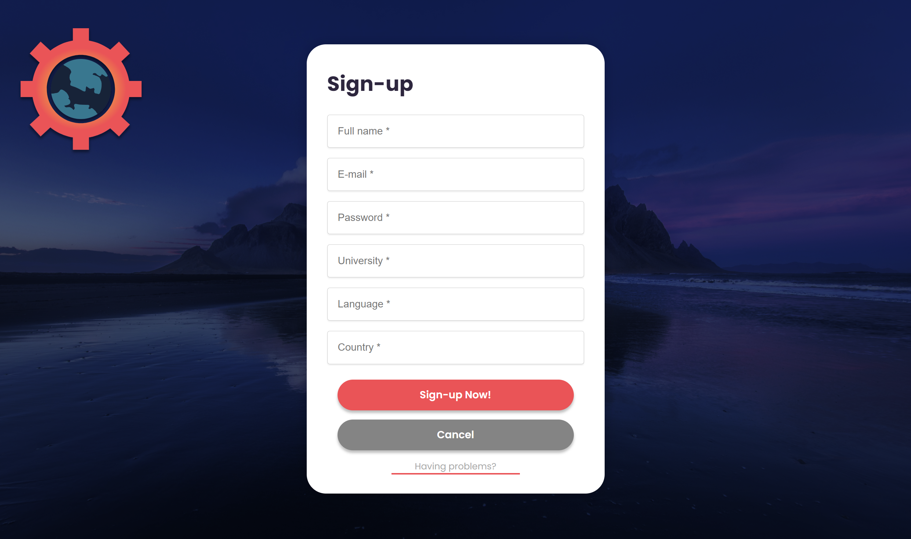

<sup>Fonte: Material produzido pelos autores (2024)</sup>
</div>


### 4.1.2. Tela de Login
&nbsp;&nbsp;&nbsp;&nbsp;Criou-se a tela de login, que permite os usuários existentes acessarem suas contas. Esta tela inclui campos para e-mail e senha, e opções para recuperação de senha. A validação inicial do formulário é realizada utilizando JavaScript no frontend. Já a autenticação é gerenciada pelo controller AuthController, o qual checa se foram inseridos dados nos campos de email e senha e se eles são compatíveis com os dados armazenados no banco de dados. Caso as senhas não coincidam, uma mensagem será enviada avisando que a senha é inválida.

<div align="center">
<sub>Figura 33 - Tela de login </sub>

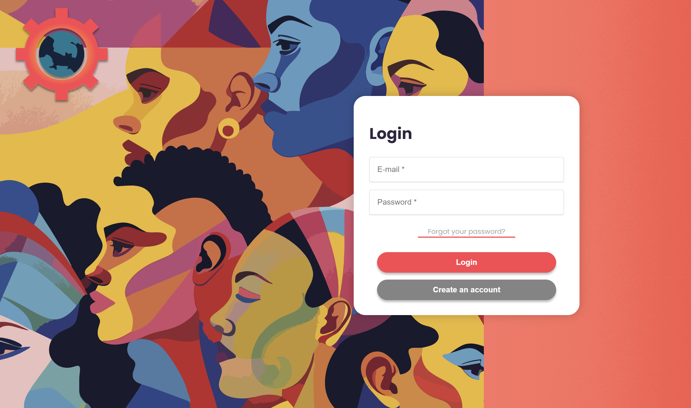

<sup>Fonte: Material produzido pelos autores (2024)</sup>
</div>


### 4.1.3. Home
&nbsp;&nbsp;&nbsp;&nbsp;Desenvolvemos a página inicial, que dá boas-vindas ao usuário e apresenta uma imagem de um mapa mundi para demonstrar a intenção de integração global. Abaixo, há um medidor de felicidade média do grupo e um local em que será adicionado as fotos dos membros dos grupos, as quais mostrarão se o usuário está offline ao entrar em estado de hover. Por fim, criou-se uma div para adicionar a área de "Tasks" e "Schedule". Na tela de homepage, foi feito apenas o básico do frontend.

<div align="center">
<sub>Figura 34 - Parte de cima da tela de Homepage  </sub>

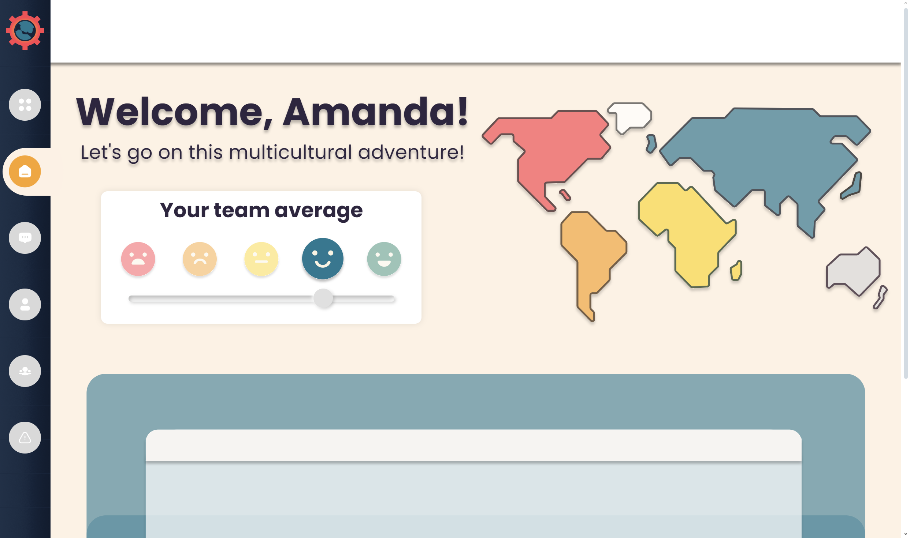

<sup>Fonte: Material produzido pelos autores (2024)</sup>
</div>


<div align="center">
<sub>Figura 35 - Parte de baixo da tela de homepage </sub>

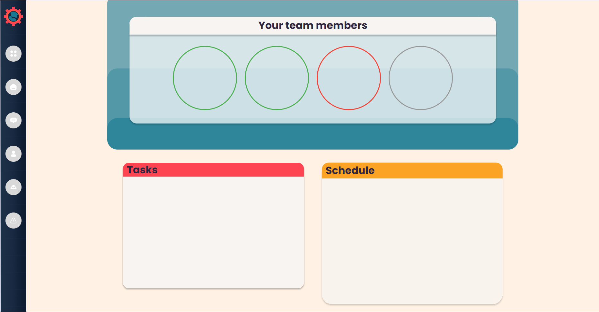

<sup>Fonte: Material produzido pelos autores (2024)</sup>
</div>


### 4.1.4. Tooltip Personalizada
&nbsp;&nbsp;&nbsp;&nbsp;Implementou-se tooltips personalizados que aparecem quando o usuário passa o mouse sobre ícones ou botões na barra lateral, proporcionando uma maneira intuitiva e não intrusiva de fornecer informações adicionais. Além disso, os ícones da side bar mudam de cor em estado de hover, a fim de indicar para o usuário que o ícone é clicável.

<div align="center">
<sub>Figura 36 - Tooltip da sidebar </sub>

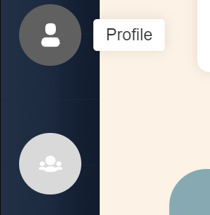

<sup>Fonte: Material produzido pelos autores (2024)</sup>
</div>


### 4.1.5. Dificuldades
&nbsp;&nbsp;&nbsp;&nbsp;Abaixo há uma lista de dificuldades que foram enfrentadas durante as duas semanas da terceira sprint:

- Ajustar o layout para ser responsivo em diferentes dispositivos.
- Garantir que as tooltips sejam visíveis e funcionem corretamente em todos os navegadores.
- Implementar validações e formatações adequadas para o banco de dados dos usuários.

### 4.1.6. Próximos Passos
- **Melhorias na UI/UX**: Continuar aprimorando a interface do usuário para torná-la mais intuitiva e agradável.
- **Testes e Debugging**: Realizar testes extensivos para identificar e corrigir bugs, garantindo uma experiência suave para os usuários.
- **Feedback dos Usuários**: Coletar feedback dos primeiros usuários para orientar melhorias futuras e garantir que o produto final atenda às necessidades do público-alvo.

&nbsp;&nbsp;&nbsp;&nbsp;Essa primeira versão estabeleceu a base para o acesso inicial do usuário no website, por meio da criação das telas de cadastro, login e homepage. Além disso, a implementação da sidebar será essencial para estabelecer a conexão entre o restante das telas futuramente. 

## 4.2. Segunda versão da aplicação web 
&nbsp;&nbsp;&nbsp;&nbsp;Na segunda versão do projeto, procurou-se terminar o backend da homepage, implementando a definição da média do medidor de felicidade do grupo e a criação, deleção e edição das tasks. Também foi criado o front-end e o back-end do formulário de avaliação do perfil de colaboração do usuário; assim como a tela do seu respectivo resultado. Por fim, iniciou-se a tela de perfil com a implementação do frontend.

### 4.2.1 Tela de avaliação do estilo de colaboração
&nbsp;&nbsp;&nbsp;&nbsp;Essa tela é acessada por meio do primeiro ícone da sidebar. Ela possui um formulário de autoavaliação com seis questões com os itens A, B, C, D e E. Tal questionário classifica o perfil de colaboração do usuário nas categorias: diretor, conformista, harmonizador, iniciador e analista.

- Front-end<br>
&nbsp;&nbsp;&nbsp;&nbsp;Para fazer uma varredura inicial dos dados inseridos no formulário, criou-se um script de JavaScript no HTML, que possui uma função que verifica se todas as questões foram respondidas e, caso não, emite uma notificação para que o usuário termine o preenchimento. Além disso, outra função quantifica cada item respondido (A, B, C, D e E) e checa qual item foi mais respondido, afim de gerar o resultado de acordo com a seguinte lógica:

<div align="center">
<sub>Tabela x - Correlação de itens e perfis</sub>
 
Item mais respondido | Resultado do perfil
--- | ---
A | Diretor
B | Conformista
C | Harmonizador
D | Iniciador
E | Analista

<sup>Fonte: Material produzido pelos autores (2024)</sup>
</div>

&nbsp;&nbsp;&nbsp;&nbsp;Por fim, essa mesma função envia esses dados como uma requisição, a qual será pega pelo controller "ColabController".

- Back-end<br>
&nbsp;&nbsp;&nbsp;&nbsp;O back-end do formulário consiste por um controller chamado "ColabController" e um model "Results", que é onde serão armazenados os dados da quantificação dos itens repondidos e do resultado final do perfil.
&nbsp;&nbsp;&nbsp;&nbsp;No controller, há uma função assíncrona chamada "answer", que pega os dados enviados pela requisição do front-end e os armazena no objeto "qntAnswer", que possui os mesmos atributos do model "Results". Esse objeto, é enviado para o model mencionado e então o controller redireciona o usuário para a tela de resultados.

#### 4.2.1.1. Telas de resultado do estilo de colaboração
&nbsp;&nbsp;&nbsp;&nbsp;Desenvolvemos as telas de resultados do formulário de colaboração, previamente implementado no script. Essas telas incluem a descrição do tipo de perfil obtido pela pessoa ao responder as perguntas, demonstrando as fraquezas e forças e onde ela pode implementar tais qualidades dentro do trabalho em grupo.<br>
&nbsp;&nbsp;&nbsp;&nbsp;Dependendo do perfil, as descrições e características mudam, por isso foram criadas telas para cada perfil, sendo no total 5 telas, conforme mencionado no tópico 4.2.1.

<div align="center">
<sub>Figura x - Layout da tela de resultado</sub>
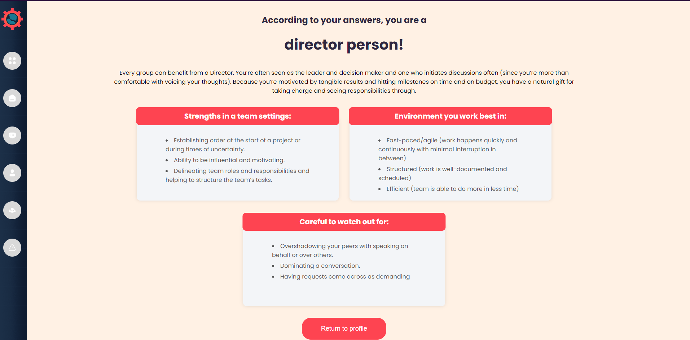
<sup>Fonte: Material produzido pelos autores (2024)</sup>
</div>

### 4.2.2. Tela de Perfil
&nbsp;&nbsp;&nbsp;&nbsp;Implementamos uma nova tela de perfil, onde os usuários podem visualizar e editar suas informações pessoais, além de definir uma foto de perfil. Esta tela foi desenvolvida para ser intuitiva e funcional, garantindo uma experiência agradável ao usuário. É importante destacar que o backend da tela de perfil é mínimo, limitando-se principalmente ao upload da imagem de perfil. A foto do perfil do usuário será exibida também na homepage, melhorando a personalização e identificação visual do usuário no sistema.

<div align="center">
<sub>Figura x - Tela de perfil</sub>
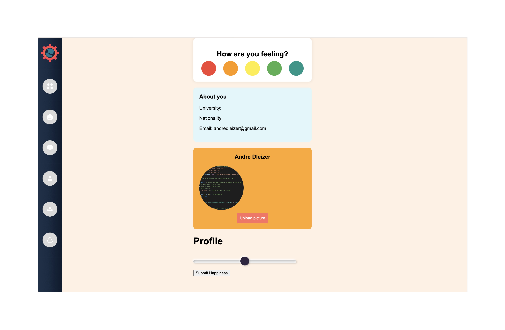
<sup>Fonte: Material produzido pelos autores (2024)</sup>
</div>

### 4.2.3 Tela de Homepage
&nbsp;&nbsp;&nbsp;&nbsp;Esta tela foi iniciada na primeira versão do site e está explicada na seção 4.1.3 denominada "Home". Porém, na segunda versão essa tela sofreu algumas alterações: o campo de scheduel foi removido, o campo de taks ganhou mais espaço e o medidor de felicidade do grupo ganhou uma lógica no backend, deixando de ser definido pelo usuário na homepage (visto que essa informação envolve todos os membros od time, e não só o usuário em si). Ainda, na seção de tasks, foi implementada uma regra de negócio que permite a criação de novas tasks, ou seja, quando o usuário clica no botão "create task" um pop-up é acionado, permitindo que uma nova task seja criada com título e descrição. Após a criação da task, o usuário poderá alterá-la (botão update) ou deletá-la (botão delete) dentro do prório card da task.
 
<div align="center">
<sub>Figura x - Quadro de tasks da homepage </sub>

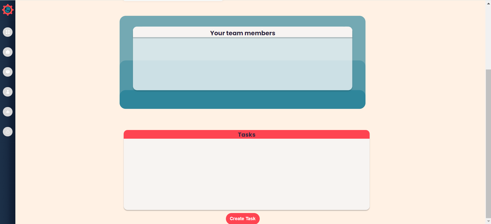

<sup>Fonte: Material produzido pelos autores (2024)</sup>
</div>

<div align="center">
<sub>Figura x - Parte inferior da homepage</sub>


<sub>Figura x - pop-up de criação da task </sub>

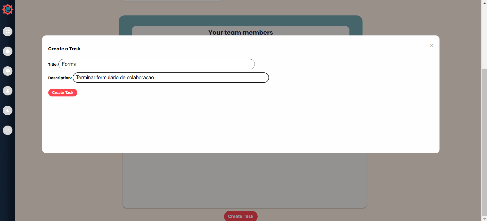

<sup>Fonte: Material produzido pelos autores (2024)</sup>
</div>

<sub>Figura x - quadro de tasks após a inderção de uma nova task </sub>

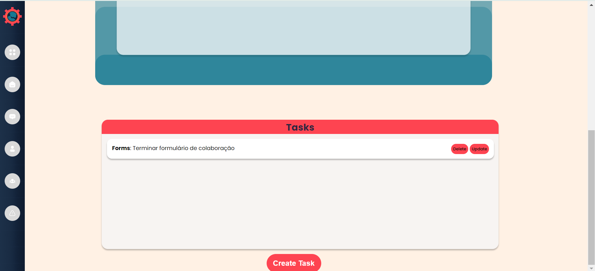

<sup>Fonte: Material produzido pelos autores (2024)</sup>
</div>

- Front-end <br>
&nbsp;&nbsp;&nbsp;&nbsp;Durante o desenvolvimento da segunda versão da homepage, a principal necessidade era a remoção do quadro de schedule, assim como o aumento da largura do quadro de tasks. Para a realização dessa tarefa, o principal desafio foi a refatoração do código, visto que foi necessária uma reorganização das divs para que o quadro de tasks passasse a ocupar a largura da tela. Assim, foram feitas edições não só no style da homepage, mas também no do layout, o qual continha divs que impediam o redimensionamento do quadro de tasks e a reorganização dos elementos na tela.<br>
&nbsp;&nbsp;&nbsp;&nbsp;Além disso, considerando as boas práticas de programação, separamos a tag <code>style</code> do restante do HTML, e agora todos os estilos da homepage estão presentes no arquivo <code>homepage.less</code>. Por fim, foi necessária a criação de novos comandos de estilo para serem aplicados às tasks criadas, ou seja, foi implementado um CSS para dar às tarefas um aspecto de "card", mantendo-as mais organizadas. <br>


- Back-end <br> 
&nbsp;&nbsp;&nbsp;&nbsp;A homepage da aplicação possui várias funcionalidades essenciais, começando pela verificação da autenticação do usuário. Caso o usuário não esteja logado, ele é redirecionado para a página de login. Uma vez autenticado, as informações do usuário são buscadas no banco de dados. Se o usuário fizer parte de um time, a média de felicidade do grupo é calculada para determinar o valor do medidor de felicidade exibido na homepage. A view homepage.ejs é então renderizada com as informações do usuário, como nome, e a média de felicidade do grupo.<br>
&nbsp;&nbsp;&nbsp;&nbsp;Para implementar o quadro de tarefas na homepage, foi criado um novo model chamado "Task.js". Este model inclui os atributos title e description, ambos do tipo string, e uma chave estrangeira user_id que referencia a tabela de usuários. No controlador HomepageController.js, foram adicionadas três funções: createTask, fetchTasks, e deleteTask. Essas funções gerenciam a lógica de negócios e a interação entre o model Task e a view homepage.ejs.<br>
&nbsp;&nbsp;&nbsp;&nbsp;O script da homepage.ejs é responsável por gerenciar a exibição e manipulação das tarefas na página. Ele controla a abertura e fechamento de modais para criação e atualização de tarefas, envia dados do formulário para criar ou atualizar tarefas no servidor usando fetch, e atualiza a interface do usuário conforme necessário. Além disso, permite excluir tarefas e exibe todas as tarefas ao carregar a página. A função addTaskToList adiciona tarefas à lista, enquanto updateTaskInList e deleteTask atualizam ou removem tarefas, respectivamente. Event listeners são usados para manusear as interações do usuário com as tarefas.

### 4.2.x Tela de formulário de Decision-Make
&nbsp;&nbsp;&nbsp;&nbsp; Desenvolvemos a tela do formulário de Decision Make, nela há duas parte do formulário, na primeira parte são questões relacionadas ao estilo de tomador de decisão, com somente duas respostas, já na segunda parte são questões hipotéticas e as respostas são de como uma pessoa responderia a essa situação. No back-end, houve a implementação de uma lógica em JavaScript para determinar o perfil conforme a resposta dada.
<br>
&nbsp;&nbsp;&nbsp;&nbsp;Primeiro, o script calcula a quantidade de respostas 'A' e 'B' para as três primeiras perguntas e, separadamente, para as quatro últimas perguntas. Com base nesses valores calculados, o script determina o estilo de tomada de decisão do usuário, que pode ser:

- **Conceitual**: quando x > 0 e y > 0
- **Comportamental**: quando x > 0 e y < 0
- **Analítico**: quando x < 0 e y > 0
- **Diretivo**: nos demais casos

&nbsp;&nbsp;&nbsp;&nbsp;Depois de determinar o estilo de decisão, o script redireciona o usuário para uma URL específica correspondente ao estilo identificado. Finalmente, os dados do formulário são enviados para um endpoint '/decisionForm' utilizando a função fetch.

<div align="center">
<sub>Figura x - Layout do Decision-Making Style</sub>
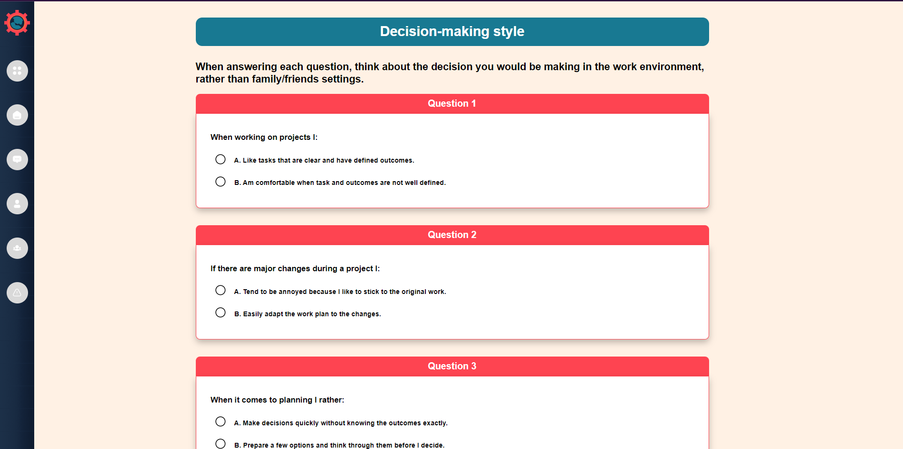
<sup>Fonte: Material produzido pelos autores (2024)</sup>
</div>

<div align="center">
<sub>Figura x - Layout do Given Situations</sub>
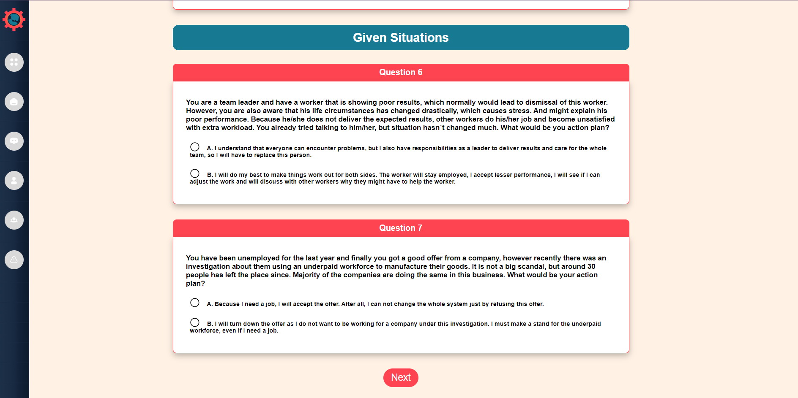
<sup>Fonte: Material produzido pelos autores (2024)</sup>
</div>

### 4.2.x Telas de resultado do Decision-Make

&nbsp;&nbsp;&nbsp;&nbsp;Desenvolvemos a tela de resultado, onde os usuários podem visualizar seu estilo de tomada de decisão. A página exibe o estilo de decisão do usuário com base em suas respostas ao formulário. O layout inclui um título principal, uma mensagem personalizada sobre o estilo identificado e uma lista de características associadas ao estilo "comportamental". A estrutura e a apresentação são geridas por classes CSS definidas no próprio código HTML.
<br>
&nbsp;&nbsp;&nbsp;&nbsp;A validação e a navegação da página são feitas no frontend, utilizando JavaScript integrado ao HTML. O botão "Return to profile" permite que os usuários retornem ao seu perfil com um clique, redirecionando para a URL '/profile'.

<div align="center">
<sub>Figura x - Layout dos resultados de Decision Make</sub>
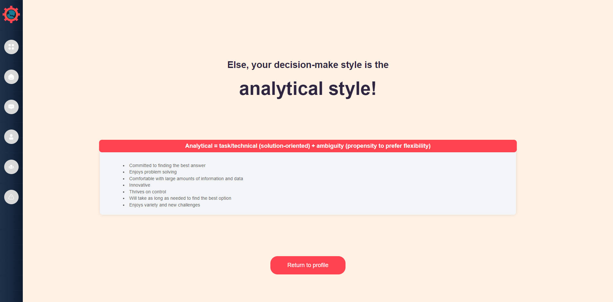
<sup>Fonte: Material produzido pelos autores (2024)</sup>
</div>

### 4.2.x Dificuldades
&nbsp;&nbsp;&nbsp;&nbsp;Num geral, enfrentou-se as seguintes dificuldades durante o desenvolvimento da segunda versão web:

- Problemas com os conflitos de merge.
- Instabilidade do banco de dados: como houve a reformulação dos models, os models antigos e novos foram enviados para o banco de dados, o que dificultou a organização dos dados e levou à recriação do banco.
- Dificuldade com a refatoração/ organização do front-end: a princípio o estilo CSS estava dentro da tag "style" do HTML, mas teve-se que separá-lo em um arquivo diferente para organizar o código.
- Garantir a compatibilidade do layout responsivo em diferentes dispositivos e navegadores.
- Implementar corretamente as funcionalidades de upload e exibição de fotos de perfil.

### 4.2.x. Próximos passos

&nbsp;&nbsp;&nbsp;&nbsp;Durante o desenvolvimento da segunda versão do sistema web, foram realizadas melhorias significativas na homepage, focando tanto na estilização quanto na funcionalidade e lógica. Além disso, foi criada uma nova tela de perfil, onde o usuário pode visualizar suas informações pessoais e definir uma foto de perfil própria. Ainda assim, existem alterações futuras que devem ser feitas, e para isso, os próximos passos são: 

- **Refinamento da UI/UX**: Continuar aprimorando a interface do usuário para torná-la mais intuitiva e esteticamente agradável.
- **Testes e Correções**: Realizar testes detalhados para identificar e corrigir quaisquer bugs ou falhas.
- **Integração de Feedback**: Coletar e integrar feedback dos usuários para orientar melhorias futuras e garantir que o produto final atenda às suas necessidades e expectativas.


## 4.3. Terceira versão da aplicação web 

*Descreva e ilustre aqui o desenvolvimento da sua terceira versão do sistema web, explicando brevemente o que foi entregue em termos de código e sistema. Utilize prints de tela para ilustrar. Indique as eventuais dificuldades e próximos passos.*

## 4.4. Versão final da aplicação web 

*Descreva e ilustre aqui o desenvolvimento da última versão do sistema web, explicando brevemente o que foi entregue em termos de código e sistema. Utilize prints de tela para ilustrar. Indique as eventuais dificuldades e próximos passos.*

# <a name="c5"></a>5. Testes

## 5.1. Relatório de testes automatizados 

&nbsp;&nbsp;&nbsp;&nbsp;Testes automatizados são processos de verificação e validação de software que são executados de forma automatizada, ou seja, sem a necessidade de intervenção humana direta. Eles envolvem o uso de ferramentas e scripts para executar casos de teste, verificar se o comportamento do software está de acordo com o esperado e relatar os resultados.
&nbsp;&nbsp;&nbsp;&nbsp;Os testes são escritos utilizando `Mocha`, `Sinon`, `Chai` e `Supertest`. `Mocha` é o framework de testes, `Sinon` é usado para criar mocks e stubs, e `Supertest` é usado para testar requisições HTTP.

(colocar o código do index inteiro aqui quando estiver pronto)

&nbsp;&nbsp;&nbsp;&nbsp;O arquivo `index.js` é um módulo JavaScript desenvolvido para auxiliar nos testes automatizados de uma aplicação que envolve criptografia de senhas com a biblioteca `bcrypt`. Começando com as importações das bibliotecas `sinon` e `bcrypt`, o código define uma série de funções e constantes essenciais para a simulação de comportamentos durante os testes.
<br>
&nbsp;&nbsp;&nbsp;&nbsp;Uma função destacada é `mockAsync`, que permite criar stubs assíncronos usando o Sinon, resolvendo para um resultado específico. Esta função é útil para criar mocks de funções assíncronas durante os testes. Além disso, o objeto `RESPONSE` é uma estrutura que simula respostas para os testes, contendo métodos para lidar com sucesso e erro.

(explicar o código index inteiro aqui quando estiver pronto)


### 5.1.1 Teste do helper hashPassword
```
//arquivo hashPassword.test.js

const assert = require('assert');
require('nyc');
const hashPasswordHelper = require('../../../api/helpers/hashPassword');
const {
  createBcryptHashStub,    // função para criar um stub bem-sucedido de bcrypt.hash.
  createBcryptHashErrorStub, // função para criar um stub que simula erro em bcrypt.hash.
  restoreBcryptHashStub,     // função para restaurar o comportamento original de bcrypt.hash.
  RESPONSE,                  // objeto que simula as respostas de sucesso e erro.
  PASSWORD,                  // a senha de entrada que será testada.
  HASHED_PASSWORD            // a senha criptografada esperada.
} = require('../../util');

describe('hashPassword Helper', () => {
  let bcryptHashStub; // variável para armazenar o stub de bcrypt.hash.

  describe('quando bcrypt.hash é bem-sucedido e criptografa a senha:', () => {
  
    beforeEach(() => {
      bcryptHashStub = createBcryptHashStub();
    });

    afterEach(() => {
      restoreBcryptHashStub(bcryptHashStub);
    });

    it('criptografa a senha', async () => {
      const result = await hashPasswordHelper.fn({ password: PASSWORD }, RESPONSE);

      assert.strictEqual(bcryptHashStub.calledOnce, true);
      assert.strictEqual(bcryptHashStub.calledWith(PASSWORD, 10), true);
      assert.strictEqual(result, HASHED_PASSWORD);
    });
  });

  describe('quando bcrypt.hash falha:', () => {
    beforeEach(() => {
      bcryptHashStub = createBcryptHashErrorStub();
    });

    afterEach(() => {
      restoreBcryptHashStub(bcryptHashStub);
    });

    it('trata os erros corretamente', async () => {
      try {
        await hashPasswordHelper.fn({ password: PASSWORD }, RESPONSE);
      } catch (err) {
        assert.strictEqual(err.message, 'Hashing error');
      }

      assert.strictEqual(bcryptHashStub.calledOnce, true);
      assert.strictEqual(bcryptHashStub.calledWith(PASSWORD, 10), true);
    });
  });
});

```
&nbsp;&nbsp;&nbsp;&nbsp;O objetivo desse teste é verificar o funcionamento do helper hashPassword, que é responsável por criptografar senhas.
O teste é dividido em dois casos, sendo eles:
1.	Quando a função bcrypt.hash, responsável pela criptografia, é bem-sucedida.
2.	Quando a função bcrypt.hash falha.

&nbsp;&nbsp;&nbsp;&nbsp;Para cada cenário, são definidos testes específicos. No primeiro caso, é verificado se a senha é criptografada corretamente e se a função bcrypt.hash é chamada com os parâmetros esperados. No segundo caso, é testado se os erros são tratados corretamente.
<br>
&nbsp;&nbsp;&nbsp;&nbsp;Ao executar esse teste, é possível verificar se o helper hashPassword está funcionando conforme o esperado em diferentes situações, garantindo a qualidade e eficiência do código.


### 5.1.2 Teste do controller HomepageController
&nbsp;&nbsp;&nbsp;&nbsp;Os testes são escritos utilizando `Mocha`, `Sinon` e `Supertest`. `Mocha` é o framework de testes, `Sinon` é usado para criar mocks e stubs, e `Supertest` é usado para testar requisições HTTP.O teste foi dividido segundo a seguinte estrutura:

- `HomepageController`: Grupo de testes para o controlador da página inicial.
- `#overview()`: Grupo de testes para a ação `overview`.

#### 5.1.2.1 Testes Específicos

###### Teste 1: Redirecionamento para /login se não estiver logado
&nbsp;&nbsp;&nbsp;&nbsp;Esse teste verifica se um usuário não autenticado é redirecionado para a página de login quando tenta acessar a página inicial. Ele faz uma requisição GET para a rota /homepage e espera que a resposta seja um redirecionamento (código de status 302) para a URL '/login'.


```
it('should redirect to /login if not logged in', function(done) {
  request(sails.hooks.http.app)
    .get('/homepage')
    .expect(302)
    .expect('location', '/login', done);
});
```

##### Teste 2: Retornar a view da homepage com usuário e média de felicidade se estiver logado
&nbsp;&nbsp;&nbsp;&nbsp;Esse teste verifica se a página inicial é exibida corretamente para um usuário autenticado, incluindo a exibição do usuário e a média de felicidade do time.


```
it('should return homepage view with user and average happiness if logged in', function(done) {
  // Mock session
  const req = {
    session: {
      userId: 1
    }
  };

  // Mock user
  const user = {
    id: 1,
    name: 'Test User'
  };

  // Mock team membership
  const teamMembership = {
    id: 1,
    id_user: 1,
    id_team: 1
  };

  // Mock team members
  const teamMembers = [
    { id_user: { happiness: 1 } },
    { id_user: { happiness: 4 } }
  ];

  // Stub User.findOne
  sinon.stub(User, 'findOne').returns(Promise.resolve(user));

  // Stub Student_team.findOne
  sinon.stub(Student_team, 'findOne').returns(Promise.resolve(teamMembership));

  // Stub Student_team.find
  sinon.stub(Student_team, 'find').returns({
    populate: sinon.stub().returns(Promise.resolve(teamMembers))
  });

  // Execute controller action
  request(sails.hooks.http.app)
    .get('/homepage')
    .set('Cookie', `sails.sid=${req.sessionID}`)
    .expect(302)
    .end(function(err, res) {
      if (err) return done(err);
      assert.strictEqual(res.status, 302);
      done();
    });

  // Restore stubs
  User.findOne.restore();
  Student_team.findOne.restore();
  Student_team.find.restore();
});
```
#### Explicação:
Mocks e Stubs:
- **Mock de sessão**: Simula uma sessão com `userId: 1`.
- **Mock de usuário**: Simula um usuário com `id: 1` e `name: 'Test User'`.
- **Mock de associação de time**: Simula uma associação de time com `id_user: 1` e `id_team: 1`.
- **Mock de membros do time**: Simula membros do time com diferentes níveis de felicidade.

Stubs:
- `User.findOne`: Stub para retornar o mock de usuário.
- `Student_team.findOne`: Stub para retornar o mock de associação de time.
- `Student_team.find`: Stub para retornar os membros do time com população.

## Execução da Ação:
```
request(sails.hooks.http.app)
  .get('/homepage')
  .set('Cookie', `sails.sid=${req.sessionID}`)
  .expect(302)
  .end(function(err, res) {
    if (err) return done(err);
    done();
  });
```
#### Restaurar Stubs:
```
User.findOne.restore();
Student_team.findOne.restore();
Student_team.find.restore();
```

&nbsp;&nbsp;&nbsp;&nbsp;Os testes para o `HomepageController` validam tanto o redirecionamento para a página de login quanto a exibição correta da página inicial para usuários autenticados. Os mocks e stubs ajudam a isolar a lógica do controlador e a garantir que os dados corretos sejam retornados. Os testes passaram com sucesso, indicando que o controlador está funcionando conforme esperado.

### 5.1.3 Teste do controller ColabController
&nbsp;&nbsp;&nbsp;&nbsp;Esse teste tem como objetivo verificar se a função "answer" do controller ColaController cria um novo resultado quando o usuário termina de preencher o formulário sobre seu estilo de colaboração. 

```
const assert = require('assert');
const sinon = require('sinon');
const ColabController = require('../../../api/controllers/ColabController');
const { QNTANSWERS, RESPONSE } = require("../../util/");

describe('ColabController', function() {
    describe('answer', function() {
        it('should create a new result and return success', async function() {
            // Arrange
            const req = {QNTANSWERS};
            const createStub = sinon.stub(ColabController, "answer").resolves({ success: true });

            // Act
            const result = await ColabController.answer(req, RESPONSE);

            // Assert
            assert.strictEqual(createStub.calledOnce, true);
            assert.deepStrictEqual(result, { success: true });

            createStub.restore();
        });
    });
});
```

&nbsp;&nbsp;&nbsp;&nbsp;Na primeiras linhas, são importadas as bibliotecas assert e sinon e o controller ColabController. Por fim, os dados "QNTASWER" e "RESPONSE" são importados do arquivo index.js, a fim de servirem como exemplos de input e output para a função "answer". Antes de começar o teste, precisou-se declarar o corpo da requisição a ser imitada por meio de "QNTASWER". Além disso, criou-se um stub que simula o funcionamento da função "answer" de ColaController.
<br>
&nbsp;&nbsp;&nbsp;&nbsp;Uma contante chamada "result" foi criada a fim de armazenar a reposta retornada pelo stub da função "answer". Por fim, foi checado se o resultado condizia com a resposta esperada.

### 5.1.4 Teste do contoller AuthController
&nbsp;&nbsp;&nbsp;&nbsp;O objetivo desse teste é verificar o funcionamento do controller AuthController, o qual é responsável por fazer a autenticação do login.
```
//src/test/unit/controllers/AuthController.test.js
const assert = require("assert");
const sinon = require("sinon");
const bcrypt = require("bcrypt");
const controller = require("../../../api/controllers/AuthController");
const { mockAsync, RESPONSE, USER } = require("../../util/");

// Encrypts the example password to simulate a user in the database
const hashedPassword = bcrypt.hashSync('password123', 10);

// Updates the mock user with the encrypted password
USER.password = hashedPassword;

describe("AuthController", () => {

  it("Should successfully log in", async () => {
    // Mock of the HTTP response
    const res = {
      status: sinon.stub().returnsThis(), // Stub for status method
      json: sinon.stub().callsFake((response) => response), // Stub for json method
      redirect: sinon.stub(), // Stub for redirect method
      ...RESPONSE // Adds other response methods, if they exist
    };

    // Mock of the HTTP request
    const req = {
      body: {
        email: USER.email,
        password: 'password123', // Correct password for the test
      },
      session: {} // Adds session to the request object
    };

    // Stub for the findOne method of the User model, returning the mock user
    const findOneStub = mockAsync(User, 'findOne', USER);
    // Stub for the bcrypt compare method, always resolving as true
    const compareStub = sinon.stub(bcrypt, 'compare').resolves(true);

    // Executes the login function of the controller
    await controller.login(req, res);

    // Verifies that the stub methods were called correctly
    assert.strictEqual(findOneStub.calledOnce, true);
    assert.strictEqual(compareStub.calledOnce, true);
    assert.strictEqual(res.redirect.calledWith('/homepage'), true); // Verifies that it redirected to /homepage
    
    // Restores the stubs to avoid side effects
    findOneStub.restore();
    compareStub.restore();
  });

  it("Should return 400 error if the email is missing", async () => {
    // Mock of the HTTP response
    const res = {
      status: sinon.stub().returnsThis(),
      json: sinon.stub(),
      ...RESPONSE
    };

    // Mock of the HTTP request without the email field
    const req = {
      body: {
        // email: USER.email, // Commented out to simulate missing email
        password: USER.password,
      },
      session: {} // Adds session to the request object
    };

    // Stub for the findOne method of the User model, will not be called in this test
    const findOneStub = mockAsync(User, 'findOne', USER);
    // Executes the login function of the controller
    await controller.login(req, res);

    // Verifies that the 400 error status was returned
    assert.strictEqual(res.status.calledWith(400), true); 
    // Verifies that findOne was not called
    assert.strictEqual(findOneStub.called, false);

    // Restores the stub
    findOneStub.restore();
  });

  it("Should return 400 error if the password is missing", async () => {
    // Mock of the HTTP response
    const res = {
      status: sinon.stub().returnsThis(),
      json: sinon.stub(),
      ...RESPONSE
    };

    // Mock of the HTTP request without the password field
    const req = {
      body: {
        email: USER.email,
        // password: USER.password, // Commented out to simulate missing password
      },
      session: {} // Adds session to the request object
    };

    // Stub for the findOne method of the User model, will not be called in this test
    const findOneStub = mockAsync(User, 'findOne', USER);
    // Executes the login function of the controller
    await controller.login(req, res);

    // Verifies that the 400 error status was returned
    assert.strictEqual(res.status.calledWith(400), true);
    // Verifies that findOne was not called
    assert.strictEqual(findOneStub.called, false);

    // Restores the stub
    findOneStub.restore();
  });

  it('Should return a 404 error when the user is not found', async () => {
    // Mock of the HTTP response
    const res = {
      status: sinon.stub().returnsThis(),
      json: sinon.stub(),
      ...RESPONSE
    };

    // Mock of the HTTP request with correct email and password
    const req = {
      body: {
        email: USER.email,
        password: USER.password,
      },
      session: {} // Adds session to the request object
    };

    // Stub for the findOne method of the User model, simulating user not found
    const findOneStub = mockAsync(User, 'findOne', USER).resolves(null);

    // Executes the login function of the controller
    await controller.login(req, res);

    // Verifies that the 404 error status was returned
    assert.strictEqual(res.status.calledWith(404), true);

    // Restores the stub
    findOneStub.restore();
  });

  it('Should return a 403 error when the password is invalid', async () => {
    // Mock of the HTTP response
    const res = {
      status: sinon.stub().returnsThis(),
      json: sinon.stub(),
      ...RESPONSE
    };

    // Mock of the HTTP request with correct email but wrong password
    const req = {
      body: {
        email: USER.email, 
        password: 'wrongpassword',
      },
      session: {} // Adds session to the request object
    };

    // Stub for the findOne method of the User model, returning the mock user
    const findOneStub = mockAsync(User, 'findOne', USER);

    // Executes the login function of the controller
    await controller.login(req, res);

    // Verifies that the 403 error status was returned
    assert.strictEqual(res.status.calledWith(403), true); 
    // Verifies that findOne was called once
    assert.strictEqual(findOneStub.calledOnce, true);

    // Restores the stub
    findOneStub.restore();
  });

  it("Should return a 500 error in case of an unexpected error", async () => {
    // Mock of the HTTP request with correct data
    const req = {
      body: {
        email: USER.email,
        password: 'password123',
      },
      session: {}
    };

    // Mock of the HTTP response
    const res = {
      status: sinon.stub().returnsThis(),
      json: sinon.stub(),
      ...RESPONSE
    };

    // Stub for the findOne method of the User model, simulating an unexpected error
    const findOneStub = mockAsync(User, 'findOne', USER);

    // Executes the login function of the controller
    await controller.login(req, res);

    // Verifies that findOne was called once
    assert.strictEqual(findOneStub.calledOnce, true);
    // Verifies that the 500 error status was returned
    assert(res.status.calledWith(500), true);

    // Restores the stub
    findOneStub.restore();
  });
  
});
```


Para testar a funcionalidade desse controller como um todo, foram criados testes específicos, sendo eles:
1. Verifica se o login pode ser realizado com sucesso quando fornecidas credenciais válidas;
2. Verifica se o campo de email está vazio;
3. Verifica se o campo de senha está vazio;
4. Veirfica se o usuário está cadastrado no banco de dados;
5. Verifica se a senha é válida;
6. Verifica demais erros presentes no sistema (internal server error).


&nbsp;&nbsp;&nbsp;&nbsp;Em cada caso específico, são definidos cenários que testam se o códifo está funconando corretamente, e essa verificação ocorre por meio da análise dos códigos de status http retornados em cada um dos testes.
<br>
&nbsp;&nbsp;&nbsp;&nbsp;Ao executar esse teste, é possível verificar se o controller AuthController está funcionando conforme o esperado em diferentes situações, garantindo a qualidade e eficiência do código.

### 5.1.5 Teste do controller `UsuarioController`

#### Teste: Criação de Usuário

```javascript
// test/unit/UserController.test.js
const assert = require('assert');
const sinon = require('sinon');
const bcrypt = require('bcrypt');
const UserController = require('../../api/controllers/UsuarioController');
const { mockAsync, RESPONSE, USER } = require("../../util/");

describe('UserController', () => {

    describe('create', () => {

        let req, res, userCreateStub, hashStub;

        beforeEach(() => {
            req = {
                body: {
                    firstName: 'João',
                    lastName: 'Silva',
                    email: 'joao.silva@example.com',
                    password: 'password123',
                    university: 'Universidade XYZ',
                    nationality: 'Brasileiro'
                },
                session: {}
            };

            res = {
                redirect: sinon.spy(),
                status: sinon.stub().returns({ json: sinon.spy() })
            };

            userCreateStub = sinon.stub(User, 'create').returns({
                fetch: () => Promise.resolve({ id: 1, ...req.body })
            });

            hashStub = sinon.stub(bcrypt, 'hash').resolves('hashed_password');
        });

        afterEach(() => {
            userCreateStub.restore();
            hashStub.restore();
        });

        it('Deve criar usuário com sucesso e enviar informações para o banco de dados', async () => {
            await UserController.create(req, res);

            // Verifica se o User.create foi chamado com os dados corretos
            assert(userCreateStub.calledOnce);
            const args = userCreateStub.getCall(0).args[0];
            assert.strictEqual(args.firstName, req.body.firstName);
            assert.strictEqual(args.lastName, req.body.lastName);
            assert.strictEqual(args.email, req.body.email);
            assert.strictEqual(args.university, req.body.university);
            assert.strictEqual(args.nationality, req.body.nationality);
            assert.strictEqual(req.session.userId, 1);
            assert(res.redirect.calledWith('/login'));
        });

        it('Deve criptografar a senha antes de salvar no banco de dados', async () => {
            await UserController.create(req, res);

            // Verifica se bcrypt.hash foi chamado com a senha correta
            assert(hashStub.calledOnceWith('password123', 10));

            // Verifica se o User.create foi chamado com a senha criptografada
            const args = userCreateStub.getCall(0).args[0];
            assert.strictEqual(args.password, 'hashed_password');
        });
    });
});
```

### Explicação do Teste

&nbsp;&nbsp;&nbsp;&nbsp;O objetivo desse teste é verificar o funcionamento do `UsuarioController`, especificamente a função `create`, que é responsável por criar novos usuários na aplicação.

#### Estrutura do Teste

1. **Configuração Inicial**:
   - O teste começa configurando `req` e `res` para simular uma requisição e resposta HTTP.
   - São utilizados `sinon.stub` para criar stubs das funções `User.create` e `bcrypt.hash`.

2. **Testes Específicos**:
   - **Teste de Criação de Usuário**: Verifica se o método `User.create` é chamado com os dados corretos e se a sessão do usuário (`req.session.userId`) é atualizada corretamente após a criação do usuário.
   - **Teste de Criptografia de Senha**: Verifica se a senha fornecida pelo usuário é criptografada corretamente antes de ser salva no banco de dados.

#### Conclusão

&nbsp;&nbsp;&nbsp;&nbsp;Os testes confirmam que o `UsuarioController` funciona conforme o esperado em diferentes cenários. Verificamos que os dados são enviados corretamente para o banco de dados e que a senha é criptografada antes de ser salva. Esses testes são essenciais para garantir a segurança e a integridade dos dados dos usuários.


## 5.2. Testes de usabilidade 

### 5.2.1 Registros de testes e melhorias

*Posicione aqui as tabelas com enunciados de tarefas, etapas e resultados de testes de usabilidade. Ou utilize um link para seu relatório de testes (mantenha o link sempre público para visualização)*

# <a name="c6"></a>6. Conclusões e trabalhos futuros 

*Escreva de que formas a solução da aplicação web atingiu os objetivos descritos na seção 2 deste documento. Indique pontos fortes e pontos a melhorar de maneira geral.*

*Relacione os pontos de melhorias evidenciados nos testes com planos de ações para serem implementadas. O grupo não precisa implementá-las, pode deixar registrado aqui o plano para ações futuras*

*Relacione também quaisquer outras ideias que o grupo tenha para melhorias futuras*

# <a name="c7"></a>7. Referências 

1. Fact Card. Universities of Applied Sciences. Disponível em: https://factcards.nl/themes/studying/universities-applied-sciences/Zuyd/. Acesso em 17 abr. 2024 <br>
2. QUACQUARELLI, Symonds. Top Universities. Zuyd University. Disponível em: https://www.topuniversities.com/universities/zuyd-university. Acesso em: 17 abr. 2024 <br>
3. Study Portals. Zuyd University of Applied Sciences. Disponível em: https://www.mastersportal.com/universities/99/zuyd-university-of-applied-sciences.html#content:student_life. Acesso em: 17 abr. 2024 <br>
4. ZUYD. Zuyd University of Applied Sciences. Dispoível em: https://www.zuyd.nl/en. Acesso em 17 abr. 2024 <br>
5. HARLEY, Aurora. Personas Make Users Memorable for Product Team Members. Disponível em: https://www.nngroup.com/articles/persona/. Acesso em 26 abr. 2024 <br>
6. GIBBON, Sarah. Empathy Mapping: The First Step in Design Thinking. Disponível em: https://www.nngroup.com/articles/empathy-mapping/. Acesso em 26 abr. 2024 <br>
7. DOMINGO, Muriel Garreta. User Stories: As a [UX Designer] I want to [embrace Agile] so that [I can make my projects user-centered]. Disponível em: https://www.interaction-design.org/literature/article/user-stories-as-a-ux-designer-i-want-to-embrace-agile-so-that-i-can-make-my-projects-user-centered. Acesso em: 26 abr. 2024
8. PESSÔA, Camila. Padrões arquiteturais: arquitetura de software descomplicada. Disponível em: https://www.alura.com.br/artigos/padroes-arquiteturais-arquitetura-software-descomplicada. Acesso em: 26 abr. 2024.
9. GUIMARÃS, Felipe. Style Guide: Como Desenvolver o Guia de Estilo da Sua Interface?. Disponível em: https://aelaschool.com/pt/designvisual/style-guide-como-desenvolver-o-guia-de-estilo-da-sua-interface/. Acesso em: 30 abr. 2024.
10. RALLO, Rafael. Tipografia: como usar um dos pilares do Design Gráfico a seu favor. Disponível em: https://rockcontent.com/br/blog/tipografia/. Acesso em: 8 mai. 2024.
11. NIELSEN, Jakob. Icon Classification: Resemblance, Reference, and Arbitrary Icons. Diponível em: https://www.nngroup.com/articles/classifying-icons/. Acesso em: 8 mai. 2024.
12. ICONICOOL. Disponível em: https://www.figma.com/file/kMKGYPi0uchJXlmKEqNDg0/Iconicool-%7C-Free-Iconset-(Community)?type=design&node-id=3-250&mode=design&t=UPhwWkTRl0P71wPH-0. Acesso em: 8 mai. 2024.
13. Sobral, Wilma Sirlange. Design de interfaces: introdução. São Paulo: Erica, 2019. 1 recurso online.

# <a name="c8"></a>Anexos

*Inclua aqui quaisquer complementos para seu projeto, como diagramas, imagens, tabelas etc. Organize em sub-tópicos utilizando headings menores (use ## ou ### para isso)*
